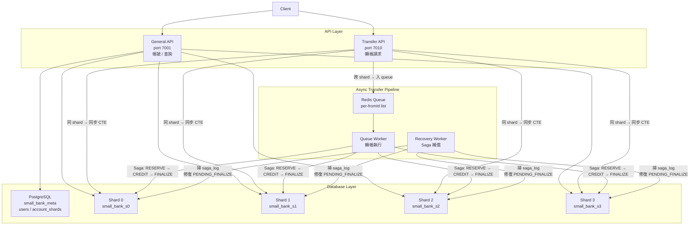

# small-bank


# High-Concurrency Transaction System

本專案是一個以「系統正確性（correctness）」與「流程控制（control flow）」為核心設計的高併發交易系統。

不同於一般以 CRUD 為主的後端專案，本系統著重於在高併發情境下，確保資料一致性、執行順序的可預測性，以及在異常情況下的安全處理能力。

---

## 設計目標

- 在高併發請求下，確保資料一致性（避免資料錯誤或不一致）
- 建立可預測的執行流程（deterministic execution）
- 提供完整的錯誤處理機制（retry / rollback / rejection）
- 控制系統負載（queue + back-pressure）

---

## 核心特性

- 使用 queue 機制序列化寫入操作，避免 race condition
- 透過 transaction 確保操作的原子性與安全性
- 設計 retry 與 timeout 機制，提高系統穩定性
- 支援高併發壓測，並驗證資料正確性（consistency check）

---

## 系統設計觀點（System Design Perspective）

本系統可視為一種「控制流程系統」的抽象模型：

- Transfer（轉帳） ≈ 控制指令（Control Command）
- Balance（餘額） ≈ 系統狀態（System State）
- Transaction ≈ 安全保證機制（Safety Guarantee）
- Queue ≈ 指令排程（Command Scheduling）

透過上述設計，使系統在高併發與不確定性環境中，仍能維持穩定且正確的行為。

---

## 適用場景

- 高併發後端系統
- 即時資料處理系統
- 需強一致性的應用場景
- 控制系統 / 工業自動化流程（Conceptual Mapping）


---

## 目錄

- [專案動機](#專案動機)
- [系統架構](#系統架構)
- [技術選型](#技術選型)
- [核心設計：三餘額模型](#核心設計三餘額模型)
- [跨 Shard 轉帳：Saga Pattern](#跨-shard-轉帳saga-pattern)
- [API 說明](#api-說明)
- [快速啟動](#快速啟動)
- [壓測](#壓測)
- [已知限制](#已知限制)

---

## 專案動機

真實的銀行系統面對的最難問題不是功能複雜度，而是**如何在高並發下不出錯**：轉帳不能重複扣款、不能憑空增加餘額、跨資料庫的操作失敗時要能補償回去。

這個專案的目標就是實作一個能回答以下問題的系統：

- 跨 shard 的資金轉移如何保證最終一致性？
- 高並發下的 row-level lock 競爭如何處理？
- 系統重啟後，中途失敗的轉帳如何自動修復？

---

## 系統架構

```
┌─────────────────────────────────────────────────────┐
│                      Client                         │
└──────────────┬───────────────────┬──────────────────┘
               │                   │
               ▼                   ▼
   ┌───────────────────┐  ┌──────────────────┐
   │   General API     │  │  Transfer API    │
   │   port 7001       │  │  port 7010       │
   │  (帳號 / 查詢)    │  │  (轉帳請求)      │
   └────────┬──────────┘  └────────┬─────────┘
            │                      │
            ▼                      ▼
   ┌──────────────┐       ┌─────────────────┐
   │ PostgreSQL   │       │  Redis Queue    │
   │  meta DB     │       │  (per-fromId)   │
   └──────────────┘       └────────┬────────┘
            │                      │
            ▼                      ▼
   ┌──────────────────────────────────────┐
   │        PostgreSQL Shard 0 ~ 3        │
   │  (accounts / transfers / saga_log)   │
   └──────────────────────────────────────┘
            ▲
            │
   ┌──────────────────┐   ┌──────────────────┐
   │   Queue Worker   │   │ Recovery Worker  │
   │  (轉帳執行)      │   │  (Saga 補償)     │
   └──────────────────┘   └──────────────────┘
```



### 資料庫分佈

| 資料庫 | 內容 |
|--------|------|
| `small_bank_meta` | `users`、`account_shards`（帳號路由表）|
| `small_bank_s0` ~ `s3` | `accounts`、`transfers`、`saga_log`、`saga_credits`、`saga_compensations` |

### Sharding 規則

帳號依 `accountId % 4` 決定所在 shard，查詢時直接計算，不需要額外查詢路由表。

---

## 技術選型

| 元件 | 選擇 | 原因 |
|------|------|------|
| Runtime | Node.js 18+ | 非同步 I/O 適合高並發場景 |
| Framework | Egg.js | 提供 cluster 管理、middleware、生命週期管理 |
| Database | PostgreSQL × 5 | ACID 事務保證資金安全 |
| Cache / Queue | Redis | 高速讀寫，作為 transfer queue 的載體 |
| 壓測工具 | autocannon | 輕量、支援 pipeline，適合本機壓測 |

---

## 核心設計：三餘額模型

每個帳號有三個餘額欄位，設計靈感來自銀行的凍結帳款機制：

```
balance           — 帳戶總餘額（包含凍結中的金額）
available_balance — 可用餘額（用戶實際能動用的金額）
reserved_balance  — 凍結餘額（跨 shard 轉帳進行中的金額）
```

**同 shard 轉帳** 直接在同一個 transaction 內扣 `available_balance`，簡單且原子。

**跨 shard 轉帳** 則需要三個步驟：

```
Step 1  扣 available_balance，加 reserved_balance（凍結）
Step 2  對方帳號加款（credit）
Step 3  扣 reserved_balance，扣 balance（銷帳）
```

這樣設計的好處是：即使 Step 2 或 Step 3 失敗，可用餘額已在 Step 1 被正確扣除，不會出現重複消費。

---

## 跨 Shard 轉帳：Saga Pattern

跨 shard 的操作無法在單一 transaction 內完成，因此採用 **Saga Log + Recovery Worker** 確保最終一致性。

### 正常流程

```
Transfer API 收到請求
  └─ 寫入 Redis Queue（per-fromId）

Queue Worker 取出 job
  └─ Step 1：扣款方凍結（BEGIN → UPDATE + INSERT transfers + INSERT saga_log → COMMIT）
  └─ Step 2：收款方入帳（BEGIN → UPDATE + INSERT saga_credits → COMMIT）
  └─ 更新 saga_log step = 'CREDITED'
  └─ Step 3：銷帳（BEGIN → UPDATE + UPDATE transfers + UPDATE saga_log → COMMIT）
```

### 失敗補償

| 失敗點 | 補償行為 |
|--------|---------|
| Step 2 失敗 | 將凍結的 `reserved_balance` 還回 `available_balance`，transfer 標記 FAILED |
| Step 3 失敗 | transfer 標記 PENDING_FINALIZE，由 Recovery Worker 接手補完 |
| 系統重啟 | Recovery Worker 每 10 秒掃描 saga_log，補償所有卡住的轉帳 |

### 冪等保護

`saga_credits` 和 `saga_compensations` 表以 `transfer_id` 為 unique key，確保補償操作即使重複執行也不會造成資金異常。

---

## API 說明

### General API（port 7001）

| Method | Path | 說明 |
|--------|------|------|
| `POST` | `/users` | 建立用戶 |
| `POST` | `/accounts` | 開立帳號（含初始餘額）|
| `GET` | `/accounts/:id` | 查詢帳號餘額（有 Redis cache）|
| `GET` | `/transfers?accountId=` | 查詢轉帳記錄 |

### Transfer API（port 7010）

| Method | Path | 說明 |
|--------|------|------|
| `POST` | `/transfers` | 發起轉帳（同 shard 同步、跨 shard 非同步）|

### 轉帳回應格式

```json
// 同 shard（同步完成）
{ "mode": "sync", "transferId": 123, "status": "COMPLETED" }

// 跨 shard（非同步入隊）
{ "mode": "async", "jobId": "1234567890-abc", "status": "queued" }
```

---

## 快速啟動

### Docker（推薦 — 三行跑起來）

```bash
git clone https://github.com/kanglei0613/small-bank.git
cd small-bank
cp .env.example .env
docker-compose up
```

API 起來後：
- General API：`http://localhost:7001`
- Transfer API：`http://localhost:7010`
- Swagger UI：`http://localhost:7001/api-docs`

建立測試資料：
```bash
node scripts/benchmark/seed.js --concurrency=3
```

---

### 本機開發（WSL2 原生安裝）

#### 環境需求

- Node.js 18+
- PostgreSQL 16+（原生安裝，非 Docker）
- Redis 7+（原生安裝）
- WSL2（Ubuntu）

### 安裝依賴

```bash
npm install
```

### 資料庫初始化

執行建表 SQL（`scripts/db/` 目錄下），建立以下資料庫：

- `small_bank_meta`
- `small_bank_s0` ~ `small_bank_s3`

### 啟動 Stack

```bash
bash scripts/run/wsl_stack.sh restart -g 3 -t 1 -qc 8 -pgMeta 25 -pgShard 10
```

**可調整參數：**

| 參數 | 說明 | 預設值 |
|------|------|--------|
| `-g` | General API worker 數 | `3` |
| `-t` | Transfer API worker 數 | `1` |
| `-qc` | Queue worker 並發數 | `8` |
| `-pgMeta` | Meta DB pool size | `10` |
| `-pgShard` | Shard DB pool size | `10` |
| `-batchSize` | Queue drain batch size | `100` |
| `-rejectThreshold` | 每個 fromId 的拒絕閾值 | `500` |
| `-maxQueueLength` | 每個 fromId 的最大 queue 長度 | `600` |

### 建立測試資料

```bash
node scripts/benchmark/seed.js --concurrency=3
```

> ⚠️ `--concurrency` 不要設太高（建議 3），否則會打爆 meta DB pool。

### 其他指令

```bash
# 查看狀態
bash scripts/run/wsl_stack.sh status

# 查看 log
bash scripts/run/wsl_stack.sh logs general
bash scripts/run/wsl_stack.sh logs transfer
bash scripts/run/wsl_stack.sh logs queue

# 停止所有 process
bash scripts/run/wsl_stack.sh stop

# 清空資料庫 + Redis
bash scripts/run/wsl_stack.sh clean
```

---

## 壓測

詳細的壓測方法、環境設定、各階段優化過程與結果，請參考 [BENCHMARK.md](./BENCHMARK.md)。

### 快速壓測

```bash
node scripts/benchmark/mixed_rps_autocannon.js \
  --connections=200 \
  --duration=30 \
  --min-id=1 \
  --max-id=50000 \
  --init-bal=1000000 \
  --queue-drain-timeout=120
```

### 目前最佳成績

| 指標 | 數值 |
|------|------|
| 總 RPS | **9,377** |
| General API | 4,298 RPS |
| Transfer API | 5,079 RPS |
| p95 latency | 158ms |
| p99 latency | 181ms |
| 失敗率 | 0% |
| 餘額守恆 | ✅ diff = +0 |

---

## 已知限制

- **單機部署**：目前開發與壓測皆在單機 WSL 環境，尚未驗證多機水平擴展。
- **Transfer queue 非 FIFO**：per-fromId queue 確保同一發款帳號的轉帳不會並發衝突，但不同 fromId 之間的處理順序取決於 queue worker 的排程。
- **每筆借貸平衡驗證**：目前只驗證全量餘額守恆（sum 不變），尚未驗證每筆轉帳的借貸個別平衡。
- **開發環境選擇：曾嘗試以 Docker 容器化部署，但因 WSL2 的 volume mount 與 network namespace 問題導致效能異常，最終改為 PostgreSQL / Redis 原生安裝於 WSL，以確保壓測數據的準確性。
---

## Transaction Consistency

This section covers the engineering decisions behind correctness guarantees in the small-bank system.

### Sharding Strategy

Accounts are distributed across four PostgreSQL shards using a deterministic hash: `shardId = accountId % 4`. There is no routing table lookup — the shard for any account is computable from the account ID alone in O(1). The meta DB (`small_bank_meta`) holds user and account registration data only; all financial state lives exclusively in the shard databases.

This design trades query flexibility for predictable latency and horizontal scalability. A single shard can be scaled independently without affecting the others.

### Row-Level Locking and Lock Timeout

All balance mutations acquire row-level locks via `UPDATE ... WHERE id = $1`. Every transaction sets `SET LOCAL lock_timeout = '200ms'` immediately after `BEGIN`. This ensures that a lock contention caused by a slow or stuck transaction fails fast rather than piling up waiting connections. Lock timeout errors bubble up as a 503 (via the DB error code handler in `errorHandler.js`) rather than queuing indefinitely.

This is a deliberate trade-off: under extreme contention, some requests are rejected quickly rather than the entire system becoming unresponsive.

### Same-Shard Transfer: Single Round-Trip CTE

When `fromId % 4 === toId % 4`, the transfer executes inside a single PostgreSQL transaction using a chained CTE:

```sql
WITH debit AS (
  UPDATE accounts SET balance = balance - $1, available_balance = available_balance - $1
  WHERE id = $2 AND available_balance >= $1
  RETURNING ...
),
credit AS (
  UPDATE accounts SET balance = balance + $1, available_balance = available_balance + $1
  WHERE id = $3
  RETURNING id
),
ins AS (
  INSERT INTO transfers (...) SELECT ... WHERE EXISTS (SELECT 1 FROM debit) AND EXISTS (SELECT 1 FROM credit)
  RETURNING id
)
SELECT ...
```

The entire debit + credit + transfer-record write is atomic and completes in **two round trips** (BEGIN + CTE, COMMIT). If `available_balance < amount`, the `debit` CTE returns zero rows, the `ins` CTE skips the insert, and the code throws `ConflictError('insufficient funds')` — no partial state is committed.

### Cross-Shard Transfer: Saga Pattern

Distributed transactions across two PostgreSQL instances cannot use a single ACID transaction. The system implements a three-step Saga with compensating transactions:

**Step 1 — RESERVE (fromShard):** Atomically deducts `available_balance` and increments `reserved_balance` by the transfer amount. A `transfers` record with `status = 'RESERVED'` and a `saga_log` entry with `step = 'RESERVED'` are written in the same transaction. If this step fails, no money has moved and the operation is a clean no-op.

**Step 2 — CREDIT (toShard):** Credits `balance` and `available_balance` on the destination account. A `saga_credits` record (with a unique index on `transfer_id`) is written in the same transaction, providing idempotency — if Step 2 is retried, the `ON CONFLICT DO NOTHING` prevents a double credit.

**Step 3 — FINALIZE (fromShard):** Deducts `reserved_balance` and `balance` to complete the bookkeeping. Updates `transfers.status = 'COMPLETED'` and `saga_log.step = 'COMPLETED'`.

### Double-Spend Prevention

The `accounts` table enforces a DB-level `CHECK` constraint:

```sql
CONSTRAINT chk_balance_invariant CHECK (balance = available_balance + reserved_balance)
```

This constraint is enforced by PostgreSQL on every write, making it physically impossible for the three balance columns to diverge — even if application-level logic has a bug. Any UPDATE that violates this invariant is rejected with a constraint violation error.

For same-shard transfers, the `WHERE available_balance >= $1` predicate in the CTE ensures the debit only proceeds if funds are present. For cross-shard transfers, the same predicate is applied during the RESERVE step — once reserved, the funds are frozen and cannot be spent by a concurrent transfer.

### Redis Queue: Serialising Per-Account Writes

Cross-shard transfers are enqueued to a **per-fromId Redis list** (`transfer:queue:{fromId}`) before being processed by a queue worker. This design serialises all outbound transfers from a single account, eliminating the possibility of two concurrent cross-shard transfers from the same account racing against each other's RESERVE step.

Each `fromId` queue has a configurable `rejectThreshold` (default 240) and `maxQueueLength` (default 300). Requests beyond the threshold receive a `429 TooManyRequests` immediately, providing back-pressure and protecting downstream DB capacity.

A `transfer:ready` list acts as a dispatch queue — when a per-fromId queue becomes non-empty, the fromId is pushed there for the blocking worker loop (`BLPOP`) to pick up, enabling event-driven processing without polling.

### Failure Recovery

If Step 2 fails (e.g. destination account not found), the system calls `_compensateReserved`: it restores `available_balance` and decrements `reserved_balance` in a new transaction, then marks the transfer `FAILED`. A guard `AND reserved_balance >= $1` prevents a compensation from driving `reserved_balance` negative.

If Step 3 fails (e.g. a transient DB error after the credit has already committed), the transfer is marked `PENDING_FINALIZE` and the saga_log remains at `step = 'CREDITED'`. A background Recovery Worker periodically scans `saga_log` for non-terminal states and re-drives them to completion, ensuring eventual consistency even across process restarts.

The `saga_compensations` table records completed compensation operations with a unique index on `transfer_id`, making compensation itself idempotent against retries.

### Balance Conservation Verification

The benchmark suite verifies global balance conservation by summing all `balance` columns across all four shards before and after the test run. The target is `diff = 0` — no money created or destroyed. The best recorded result: **9,377 RPS, 0% failure rate, balance conservation diff = +0**.
