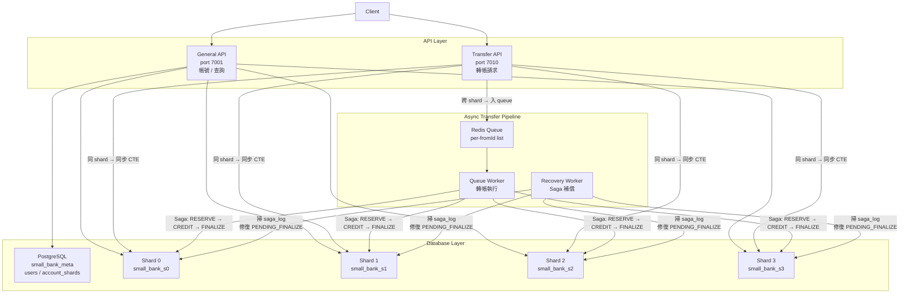

# small-bank


# High-Concurrency Transaction System

本專案是一個以「系統正確性（correctness）」與「流程控制（control flow）」為核心設計的高併發交易系統。

不同於一般以 CRUD 為主的後端專案，本系統著重於在高併發情境下，確保資料一致性、執行順序的可預測性，以及在異常情況下的安全處理能力。

---

## 設計目標

- 在高併發請求下，確保資料一致性（避免資料錯誤或不一致）
- 建立可預測的執行流程（deterministic execution）
- 提供完整的錯誤處理機制（retry / rollback / rejection）
- 控制系統負載（queue + back-pressure）

---

## 核心特性

- 使用 queue 機制序列化寫入操作，避免 race condition
- 透過 transaction 確保操作的原子性與安全性
- 設計 retry 與 timeout 機制，提高系統穩定性
- 支援高併發壓測，並驗證資料正確性（consistency check）

---

## 系統設計觀點（System Design Perspective）

本系統可視為一種「控制流程系統」的抽象模型：

- Transfer（轉帳） ≈ 控制指令（Control Command）
- Balance（餘額） ≈ 系統狀態（System State）
- Transaction ≈ 安全保證機制（Safety Guarantee）
- Queue ≈ 指令排程（Command Scheduling）

透過上述設計，使系統在高併發與不確定性環境中，仍能維持穩定且正確的行為。

---

## 適用場景

- 高併發後端系統
- 即時資料處理系統
- 需強一致性的應用場景
- 控制系統 / 工業自動化流程（Conceptual Mapping）


---

## 目錄

- [專案動機](#專案動機)
- [系統架構](#系統架構)
- [技術選型](#技術選型)
- [前端架構](#前端架構)
- [核心設計：三餘額模型](#核心設計三餘額模型)
- [跨 Shard 轉帳：Saga Pattern](#跨-shard-轉帳saga-pattern)
- [API 說明](#api-說明)
- [快速啟動](#快速啟動)
- [即時監控 Dashboard](#即時監控-dashboard)
- [壓測](#壓測)
- [已知限制](#已知限制)
- [Architecture Review](#architecture-review)

---

## 專案動機

真實的銀行系統面對的最難問題不是功能複雜度，而是**如何在高並發下不出錯**：轉帳不能重複扣款、不能憑空增加餘額、跨資料庫的操作失敗時要能補償回去。

這個專案的目標就是實作一個能回答以下問題的系統：

- 跨 shard 的資金轉移如何保證最終一致性？
- 高並發下的 row-level lock 競爭如何處理？
- 系統重啟後，中途失敗的轉帳如何自動修復？

---

## 系統架構

```
┌─────────────────────────────────────────────────────┐
│                      Client                         │
└──────────────┬───────────────────┬──────────────────┘
               │                   │
               ▼                   ▼
   ┌───────────────────┐  ┌──────────────────┐
   │   General API     │  │  Transfer API    │
   │   port 7001       │  │  port 7010       │
   │  (帳號 / 查詢)    │  │  (轉帳請求)      │
   └────────┬──────────┘  └────────┬─────────┘
            │                      │
            ▼                      ▼
   ┌──────────────┐       ┌─────────────────┐
   │ PostgreSQL   │       │  Redis Queue    │
   │  meta DB     │       │  (per-fromId)   │
   └──────────────┘       └────────┬────────┘
            │                      │
            ▼                      ▼
   ┌──────────────────────────────────────┐
   │        PostgreSQL Shard 0 ~ 3        │
   │  (accounts / transfers / saga_log)   │
   └──────────────────────────────────────┘
            ▲
            │
   ┌──────────────────┐   ┌──────────────────┐
   │   Queue Worker   │   │ Recovery Worker  │
   │  (轉帳執行)      │   │  (Saga 補償)     │
   └──────────────────┘   └──────────────────┘
```



### 資料庫分佈

| 資料庫 | 內容 |
|--------|------|
| `small_bank_meta` | `users`、`account_shards`（帳號路由表）|
| `small_bank_s0` ~ `s3` | `accounts`、`transfers`、`saga_log`、`saga_credits`、`saga_compensations` |

### Sharding 規則

帳號依 `accountId % 4` 決定所在 shard，查詢時直接計算，不需要額外查詢路由表。

---

## 技術選型

| 元件 | 選擇 | 原因 |
|------|------|------|
| Runtime | Node.js 20 LTS | 非同步 I/O 適合高並發場景 |
| Backend Framework | Egg.js | 提供 cluster 管理、middleware、生命週期管理 |
| Frontend Framework | Vue 3 + TypeScript | Composition API、型別安全、元件化開發 |
| 前端建構 | Vite 5 | 快速 HMR，原生 ESM，支援 TypeScript 與 Vue SFC |
| 狀態管理 | Pinia | Vue 3 官方推薦，輕量且支援 TypeScript 型別推導 |
| 路由 | Vue Router 4 | SPA 路由，支援 history mode |
| HTTP Client | Axios | 統一 API 請求，設定 baseURL 分離 generalApi / transferApi |
| Database | PostgreSQL × 5 | ACID 事務保證資金安全 |
| Cache / Queue | Redis | 高速讀寫，作為 transfer queue 的載體 |
| 壓測工具 | autocannon | 輕量、支援 pipeline，適合本機壓測 |

---

## 前端架構

前端為獨立的 **Vue 3 SPA**，以 Vite 建構，使用 TypeScript 全面覆蓋型別。

### 技術棧

| 層級 | 技術 | 說明 |
|------|------|------|
| 框架 | Vue 3 (Composition API) | `<script setup>` 語法，邏輯與模板分離清晰 |
| 語言 | TypeScript 5 | 嚴格模式，所有 API 回傳值均有型別定義 |
| 建構 | Vite 5 | 原生 ESM、快速 HMR，別名 `@/` → `src/` |
| 狀態 | Pinia | `useAccountStore` 管理當前帳號與餘額快取 |
| 路由 | Vue Router 4 | history mode，`/account/:id` 動態路由 |
| HTTP | Axios | `generalApi`（`/api`）與 `transferApi`（`/transfer-api`）分開實例 |

### 目錄結構

```
frontend/src/
├── api/
│   └── index.ts          # 所有 API 呼叫集中管理
├── stores/
│   └── account.ts        # Pinia store：帳號、餘額、輪詢狀態
├── router/
│   └── index.ts          # 路由定義
├── types/
│   └── index.ts          # API 回傳型別（Account、Transfer、TransferJob…）
├── views/
│   ├── AccountView.vue   # 帳號總覽：餘額顯示、存提款操作
│   └── TransfersView.vue # 轉帳紀錄：sync/async 標籤、方向判斷
└── main.ts               # 應用程式進入點
```

### 關鍵設計說明

**BigInt 型別轉換**：PostgreSQL `bigint` 欄位（`id`、`from_account_id`、`to_account_id`、`amount`）經 `pg` driver 回傳為 JavaScript `string`。`api/index.ts` 的 `fetchTransfers` 對所有 bigint 欄位一律補 `Number()` 強制轉型，確保嚴格比較（`===`）與轉帳方向判斷正確。

**轉帳模式判斷（sync / async）**：後端 DB 不儲存 `mode` 欄位，前端根據 `from_account_id % 4 === to_account_id % 4` 判斷是否跨 shard，同 shard → `sync`，跨 shard → `async`。

**非同步轉帳狀態追蹤**：提交跨 shard 轉帳後，前端取得 `jobId`，每 1.5 秒 polling `/transfer-jobs/:jobId`，直到狀態變為 `COMPLETED` 或 `FAILED`，再更新餘額顯示。

**雙 Axios 實例**：`generalApi` 指向 `/api`（Egg.js general server，port 7001）、`transferApi` 指向 `/transfer-api`（transfer server，port 7010），由 Vite proxy 在開發環境轉發，生產環境由 Nginx 處理。

---

## 核心設計：三餘額模型

每個帳號有三個餘額欄位，設計靈感來自銀行的凍結帳款機制：

```
balance           — 帳戶總餘額（包含凍結中的金額）
available_balance — 可用餘額（用戶實際能動用的金額）
reserved_balance  — 凍結餘額（跨 shard 轉帳進行中的金額）
```

**同 shard 轉帳** 直接在同一個 transaction 內扣 `available_balance`，簡單且原子。

**跨 shard 轉帳** 則需要三個步驟：

```
Step 1  扣 available_balance，加 reserved_balance（凍結）
Step 2  對方帳號加款（credit）
Step 3  扣 reserved_balance，扣 balance（銷帳）
```

這樣設計的好處是：即使 Step 2 或 Step 3 失敗，可用餘額已在 Step 1 被正確扣除，不會出現重複消費。

---

## 跨 Shard 轉帳：Saga Pattern

跨 shard 的操作無法在單一 transaction 內完成，因此採用 **Saga Log + Recovery Worker** 確保最終一致性。

### 正常流程

```
Transfer API 收到請求
  └─ 寫入 Redis Queue（per-fromId）

Queue Worker 取出 job
  └─ Step 1：扣款方凍結（BEGIN → UPDATE + INSERT transfers + INSERT saga_log → COMMIT）
  └─ Step 2：收款方入帳（BEGIN → UPDATE + INSERT saga_credits → COMMIT）
  └─ 更新 saga_log step = 'CREDITED'
  └─ Step 3：銷帳（BEGIN → UPDATE + UPDATE transfers + UPDATE saga_log → COMMIT）
```

### 失敗補償

| 失敗點 | 補償行為 |
|--------|---------|
| Step 2 失敗 | 將凍結的 `reserved_balance` 還回 `available_balance`，transfer 標記 FAILED |
| Step 3 失敗 | transfer 標記 PENDING_FINALIZE，由 Recovery Worker 接手補完 |
| 系統重啟 | Recovery Worker 每 10 秒掃描 saga_log，補償所有卡住的轉帳 |

### 冪等保護

`saga_credits` 和 `saga_compensations` 表以 `transfer_id` 為 unique key，確保補償操作即使重複執行也不會造成資金異常。

---

## API 說明

### General API（port 7001）

| Method | Path | 說明 |
|--------|------|------|
| `POST` | `/users` | 建立用戶 |
| `POST` | `/accounts` | 開立帳號（含初始餘額）|
| `GET` | `/accounts/:id` | 查詢帳號餘額（有 Redis cache）|
| `GET` | `/transfers?accountId=` | 查詢轉帳記錄 |

### Transfer API（port 7010）

| Method | Path | 說明 |
|--------|------|------|
| `POST` | `/transfers` | 發起轉帳（同 shard 同步、跨 shard 非同步）|

### 轉帳回應格式

```json
// 同 shard（同步完成）
{ "mode": "sync", "transferId": 123, "status": "COMPLETED" }

// 跨 shard（非同步入隊）
{ "mode": "async", "jobId": "1234567890-abc", "status": "queued" }
```

---

## 快速啟動

### Docker（推薦）

以下為完整的 Docker 環境啟動流程，每個步驟均附說明：

```bash
# 1. Clone 專案
git clone https://github.com/kanglei0613/small-bank.git
cd small-bank

# 2. 啟動整個 stack（PostgreSQL × 5、Redis、API × 2、Queue Worker、Recovery Worker）
#    第一次啟動會自動執行 initdb SQL（建表、建索引、建約束），無需手動初始化
docker compose up -d

# 3. 確認所有服務健康（所有服務應顯示 healthy 或 running）
docker compose ps

# 4. Seed：建立帳號與初始資料（約 50,000 帳號，每帳號 1,000,000 初始餘額）
#    --docker 使用容器內的 PG 連線設定（必填）
#    --users=N 建立帳號數（預設 50000）
#    --init-bal=N 每帳號初始餘額（預設 1000000）
node scripts/benchmark/seed.js --docker --users=50000 --init-bal=1000000

# 5. 啟動前端開發伺服器（Vue 3）
cd frontend && npm install && npm run dev
# 瀏覽器開啟 http://localhost:5173

# 6. 執行一般混合壓測（General + Transfer API，預設 100 並發，持續 30 秒）
node scripts/benchmark/mixed_rps_autocannon.js

# 也可指定參數：
node scripts/benchmark/mixed_rps_autocannon.js --connections=200 --duration=60 --amount=1

# 7. 執行 Sequential vs Concurrent 對比壓測（展示 row-lock contention 問題）
#    自動切換 queue-worker 模式兩輪，最後輸出對比報告
node scripts/benchmark/bench_compare.js

# 8. 完整重置（刪除所有 volume，回到乾淨狀態，再重新啟動）
docker compose down -v && docker compose up -d
```

API 起來後：
- General API：`http://localhost:7001`
- Transfer API：`http://localhost:7010`
- 前端 Dashboard：`http://localhost:5173`（npm run dev 啟動後）

---

### 指令與參數說明

#### `seed.js` — 建立測試資料

```bash
node scripts/benchmark/seed.js [選項]
```

| 參數 | 說明 | 預設值 |
|------|------|--------|
| `--docker` | 使用 Docker 容器內部 PG 連線（`docker exec psql`）。Docker 環境必填 | — |
| `--users=N` | 建立的用戶數 | `50000` |
| `--init-bal=N` | 每個帳號的初始餘額 | `1000000` |
| `--concurrency=N` | 建立帳號的並發數（本機模式，不宜過高） | `3` |

> ⚠️ Seed 完成後會在 `scripts/benchmark/.seed-config.json` 寫入帳號 ID 範圍，供後續壓測腳本自動讀取。

#### `mixed_rps_autocannon.js` — 混合 RPS 壓測

```bash
node scripts/benchmark/mixed_rps_autocannon.js [選項]
```

| 參數 | 說明 | 預設值 |
|------|------|--------|
| `--connections=N` | 總並發連線數（75% 分給 General API，25% 分給 Transfer API）| `100` |
| `--duration=N` | 壓測持續秒數 | `30` |
| `--pool-size=N` | 預先產生的請求池大小（避免壓測中途 CPU 被佔用） | `1000` |
| `--min-id=N / --max-id=N` | 帳號 ID 範圍（若有 seed config 則自動讀取，不需手動指定） | seed config |
| `--amount=N` | 每筆轉帳金額 | `1` |
| `--init-bal=N` | 帳號初始餘額（用於守恆計算基準，應與 seed 時相同） | `1000000` |
| `--queue-drain-timeout=N` | 壓測結束後，等待 async queue 清空的最大秒數；`0` 表示只等 balance-delay | `120` |
| `--balance-delay=N` | 壓測結束後等待 N 秒再做餘額檢查（排除跨 shard 最終一致性延遲） | `3` |
| `--skip-balance-check` | 跳過壓測後的餘額守恆查詢（快速跑時使用） | — |
| `--general-url=URL` | General API 位址 | `http://127.0.0.1:7001` |
| `--transfer-url=URL` | Transfer API 位址 | `http://127.0.0.1:7010` |

#### `bench_compare.js` — Sequential vs Concurrent 對比壓測

```bash
node scripts/benchmark/bench_compare.js
```

無額外命令列參數。腳本內固定 5 個跨 shard pair（各個 shard 方向均覆蓋），每個 pair 送 40 筆 job，自動執行兩輪：

- **Round 1（Concurrent）**：設定 `QUEUE_DRAIN_SEQUENTIAL=false`，重啟 queue-worker，觀察 lock_timeout 造成的大量失敗
- **Round 2（Sequential）**：設定 `QUEUE_DRAIN_SEQUENTIAL=true`，重啟 queue-worker，觀察 100% 成功率

最後輸出對比表格，結束後自動還原 queue-worker 為 sequential 模式並刪除 override 設定檔。

> ⚠️ 此腳本會寫入 `docker-compose.override.yml` 並執行 `docker compose up -d --no-deps queue-worker`，需要主機上有 Docker CLI。

#### `docker-compose.yml` 可調環境變數

可透過 shell export 或 `.env` 檔案覆寫，不需重建 image：

| 變數 | 說明 | 預設值 |
|------|------|--------|
| `QUEUE_DRAIN_SEQUENTIAL` | `true`：sequential drain（推薦，100% 成功率）；`false`：concurrent drain（對比壓測用，~1/batchSize 成功率）| `true` |
| `BATCH_SIZE` | queue-worker 每次 drain 的 batch 大小 | `100` |
| `QUEUE_CONCURRENCY` | queue-worker 的並發 BRPOP loop 數量 | `8` |
| `PG_SHARD_POOL_MAX` | 每個 shard 的 PostgreSQL 連線池上限 | `10` |
| `GENERAL_WORKERS` | General API 的 cluster worker 數 | `3` |
| `TRANSFER_WORKERS` | Transfer API 的 cluster worker 數 | `1` |
| `REJECT_THRESHOLD` | 每個 fromId queue 開始回傳 429 的長度閾值 | `500` |
| `MAX_QUEUE_LENGTH` | 每個 fromId queue 的記憶體上限 | `600` |

---

### 本機開發（WSL2 原生安裝）

#### 環境需求

- Node.js 20 LTS
- PostgreSQL 17+（原生安裝，非 Docker）
- Redis 7+（原生安裝）
- WSL2（Ubuntu）

#### 安裝依賴

```bash
npm install
```

#### 資料庫初始化

執行建表 SQL（`docker/initdb-meta/` 和 `docker/initdb-shard/` 目錄下），建立以下資料庫：

- `small_bank_meta`
- `small_bank_s0` ~ `small_bank_s3`

#### 啟動 Stack

```bash
bash scripts/run/wsl_stack.sh restart -g 3 -t 1 -qc 8 -pgMeta 25 -pgShard 10
```

**可調整參數：**

| 參數 | 說明 | 預設值 |
|------|------|--------|
| `-g` | General API worker 數 | `3` |
| `-t` | Transfer API worker 數 | `1` |
| `-qc` | Queue worker 並發數 | `8` |
| `-pgMeta` | Meta DB pool size | `10` |
| `-pgShard` | Shard DB pool size | `10` |
| `-batchSize` | Queue drain batch size | `100` |
| `-rejectThreshold` | 每個 fromId 的拒絕閾值 | `500` |
| `-maxQueueLength` | 每個 fromId 的最大 queue 長度 | `600` |

#### 其他指令

```bash
# 查看狀態
bash scripts/run/wsl_stack.sh status

# 查看 log
bash scripts/run/wsl_stack.sh logs general
bash scripts/run/wsl_stack.sh logs transfer
bash scripts/run/wsl_stack.sh logs queue

# 停止所有 process
bash scripts/run/wsl_stack.sh stop

# 清空資料庫 + Redis
bash scripts/run/wsl_stack.sh clean
```

---

## 即時監控 Dashboard

`monitor.html` 是一個單頁監控介面，直接在瀏覽器開啟即可使用，不需要額外安裝任何工具。

每秒 poll `GET /queue/global-stats`，即時顯示：

- Queue 中的待處理任務總數，以及每秒積壓 / 消化的方向（▲ / ▼）
- 活躍帳戶佇列數與 Hot Account 數量
- Top 15 熱門帳戶排行，含視覺化 queue 深度 bar（綠 → 黃 → 紅）

### 使用方式

```bash
# Docker 啟動後，直接在 Mac 開啟
open monitor.html
```

壓測跑起來的同時開著 dashboard，可以觀察哪些帳戶在高負載下成為 hot account，queue 深度如何隨流量波動，以及 worker 的消化速度。

---

## 壓測

詳細的壓測方法、環境設定、各階段優化過程與結果，請參考 [BENCHMARK.md](./BENCHMARK.md)。

### 快速壓測（Docker）

```bash
# 建立測試資料
node scripts/benchmark/seed.js --docker --users=50000 --accounts-per-user=1 --init-bal=1000000

# 執行壓測
node scripts/benchmark/mixed_rps_autocannon.js --transfer-url=http://127.0.0.1:7010 --general-url=http://127.0.0.1:7001 --duration=30 --conn-wait=30
```

### 目前最佳成績（Docker 環境）

| 指標 | 數值 |
|------|------|
| 總 RPS | **13,156** |
| General API | ~9,900 RPS |
| Transfer API | ~3,256 RPS |
| p95 latency | 36ms |
| p99 latency | 49ms |
| 總失敗率 | **0%**（全部成功）|
| 餘額守恆 | ✅ diff = +0 |

---

## 已知限制

- **單機部署**：目前開發與壓測皆在單機環境，尚未驗證多機水平擴展。
- **Transfer queue 非 FIFO**：per-fromId queue 確保同一發款帳號的轉帳不會並發衝突，但不同 fromId 之間的處理順序取決於 queue worker 的排程。
- **每筆借貸平衡驗證**：目前只驗證全量餘額守恆（sum 不變），尚未驗證每筆轉帳的借貸個別平衡。
- **Redis 單點故障**：Redis 無 HA 設計，Redis 崩潰導致 queue 服務中斷。
- **跨 shard 收款記錄缺失**：受款方在不同 shard 時，轉帳記錄不出現在受款方的帳單中。
- **Shard rebalance 未實作**：帳號 shard 路由為靜態計算（accountId % 4），不支援重新分片。
- **無 idempotency key**：客戶端重試可能導致重複轉帳。
- **無認證機制**：Transfer API 未加入 JWT/session 驗證，任何人均可發起轉帳。

---

## 交易一致性設計

本章說明 small-bank 在高併發下保證資料正確性的工程決策。

### 分片策略

帳號依照 `shardId = accountId % 4` 分散至四個 PostgreSQL shard，不需要查路由表，任何帳號的 shard 都能在 O(1) 內從帳號 ID 直接算出。Meta DB（`small_bank_meta`）只存用戶與帳號的註冊資料；所有金融狀態都在 shard 資料庫。

這個設計犧牲了跨 shard 查詢的彈性，換來可預測的延遲與水平擴展能力。每個 shard 可以獨立擴容，不影響其他 shard。

### 行級鎖與 Lock Timeout

所有餘額異動都透過 `UPDATE ... WHERE id = $1` 取得行級鎖。每筆交易在 `BEGIN` 後立即設定 `SET LOCAL lock_timeout = '200ms'`，確保鎖等待超時時快速失敗，不讓連線堆積。Lock timeout 錯誤會透過 `errorHandler.js` 的 DB 錯誤碼處理器轉成 503 回傳。

這是刻意的取捨：在極端競爭下，寧可快速拒絕少數請求，也不讓整個系統因等待堆積而無回應。

### 同 Shard 轉帳：單一 CTE 原子操作

當 `fromId % 4 === toId % 4`，轉帳在單一 PostgreSQL 交易內用串接 CTE 完成：

```sql
WITH debit AS (
  UPDATE accounts SET balance = balance - $1, available_balance = available_balance - $1
  WHERE id = $2 AND available_balance >= $1
  RETURNING ...
),
credit AS (
  UPDATE accounts SET balance = balance + $1, available_balance = available_balance + $1
  WHERE id = $3
  RETURNING id
),
ins AS (
  INSERT INTO transfers (...) SELECT ... WHERE EXISTS (SELECT 1 FROM debit) AND EXISTS (SELECT 1 FROM credit)
  RETURNING id
)
SELECT ...
```

扣款、入帳、寫入轉帳紀錄三個動作原子完成，只需兩次 round trip（BEGIN + CTE、COMMIT）。若 `available_balance < amount`，`debit` CTE 回傳零行，`ins` CTE 跳過 INSERT，程式拋出 `ConflictError('insufficient funds')`，不會有任何部分狀態被提交。

### 跨 Shard 轉帳：Saga Pattern

跨兩個 PostgreSQL 實例的分散式交易無法使用單一 ACID 交易，系統改用三步驟 Saga 搭配補償交易：

**第一步 — RESERVE（fromShard）：** 在同一交易內原子扣除 `available_balance`、增加 `reserved_balance`，並寫入 `status = 'RESERVED'` 的 `transfers` 紀錄與 `saga_log`。若此步驟失敗，資金毫無異動，是乾淨的 no-op。

**第二步 — CREDIT（toShard）：** 在目標帳號增加 `balance` 與 `available_balance`，同時寫入 `saga_credits` 紀錄（`transfer_id` 有 unique index）。若第二步重試，`ON CONFLICT DO NOTHING` 確保不會重複入帳。

**第三步 — FINALIZE（fromShard）：** 扣除 `reserved_balance` 與 `balance` 完成帳務結算，將 `transfers.status` 更新為 `'COMPLETED'`、`saga_log.step` 更新為 `'COMPLETED'`。

### 防止重複扣款

`accounts` 資料表有資料庫層級的 `CHECK` 約束：

```sql
CONSTRAINT chk_balance_invariant CHECK (balance = available_balance + reserved_balance)
```

PostgreSQL 在每次寫入時強制檢查此約束，讓三個餘額欄位在物理層面不可能出現分歧，即使應用程式邏輯有 bug 也一樣。任何違反此約束的 UPDATE 都會被資料庫直接拒絕。

同 shard 轉帳中，CTE 的 `WHERE available_balance >= $1` 確保只有餘額足夠時才執行扣款；跨 shard 轉帳中，相同的條件在 RESERVE 步驟套用，一旦資金被預留，就無法被其他並發轉帳再次動用。

### Redis 佇列：序列化同帳號的寫入

跨 shard 轉帳在執行前先進入 **per-fromId Redis list**（`transfer:queue:{fromId}`），再由 queue worker 依序處理。此設計將同一帳號的所有跨 shard 轉帳序列化，消除兩筆並發轉帳在 RESERVE 步驟互相競爭的可能性。

每個 `fromId` 佇列有可設定的 `rejectThreshold`（預設 240）與 `maxQueueLength`（預設 300）。超出閾值的請求立即回傳 `429 TooManyRequests`，提供背壓保護下游 DB 容量。

`transfer:ready` list 作為調度佇列——當某個 per-fromId 佇列從空變為非空時，該 fromId 會被 push 進去，供 worker 的阻塞式 `BRPOP` 取走，實現事件驅動處理而非輪詢。

### 失敗復原

若第二步失敗（例如目標帳號不存在），系統呼叫 `_compensateReserved`：在新的交易內還原 `available_balance`、減少 `reserved_balance`，並將轉帳標記為 `FAILED`。條件 `AND reserved_balance >= $1` 防止補償操作把 `reserved_balance` 扣成負數。

若第三步失敗（例如 Credit 已提交但 Finalize 遭遇暫時性 DB 錯誤），轉帳會被標記為 `PENDING_FINALIZE`，`saga_log` 停留在 `step = 'CREDITED'`。背景 Recovery Worker 會定期掃描 `saga_log` 中未到達終態的紀錄，重新驅動至完成，確保即使跨 process 重啟也能達到最終一致性。

`saga_compensations` 資料表記錄已完成的補償操作，`transfer_id` 有 unique index，讓補償動作本身也具備冪等性。

### 餘額守恆驗證

壓測套件透過加總四個 shard 所有帳號的 `balance` 欄位來驗證全域餘額守恆，目標是 `diff = 0`，確保沒有任何金額被憑空創造或消失。Docker 環境最佳紀錄：**13,156 RPS、全 API 0% 失敗率、餘額守恆 diff = +0**。

---

## Architecture Review

> 本章節為完整的多角色架構評審（2026-05），涵蓋設計決策、已知問題與修正記錄，可作為面試技術討論的參考依據。

### 系統架構全圖

```
                        ┌──────────────────────────────────┐
                        │            Client                │
                        └────────────┬─────────────────────┘
                                     │ HTTP
                   ┌─────────────────┼─────────────────────┐
                   ▼                 ▼                     │
       ┌───────────────────┐  ┌──────────────────┐         │
       │   General API     │  │  Transfer API    │         │
       │   port 7001       │  │  port 7010       │         │
       │ (帳號/查詢/SSE)  │  │  (轉帳請求)      │         │
       └────────┬──────────┘  └────────┬─────────┘         │
                │                      │                   │
                │ pool                 │ sync              │ async
                │                      ▼                   │
                │          ┌──────────────────────┐        │
                │          │  transferSameShard   │        │
                │          │  CTE（3 round trips）│        │
                │          └──────────────────────┘        │
                │                                          │
                │                      ┌───────────────────┘
                │                      ▼
                │          ┌──────────────────────┐
                │          │    Redis Queue       │
                │          │  per-fromId List     │
                │          │  + owner lock        │
                │          │  + heartbeat         │
                │          └──────────┬───────────┘
                │                     │ BRPOP
                │          ┌──────────▼───────────┐
                │          │    Queue Worker       │
                │          │  (CONCURRENCY loops) │
                │          │  sequential drain     │
                │          └──────────┬───────────┘
                │                     │ Saga
                ▼                     ▼
      ┌─────────────────────────────────────────────────────────┐
      │                   PostgreSQL Shards                     │
      │                                                         │
      │  ┌──────────┐  ┌──────────┐  ┌──────────┐  ┌────────┐ │
      │  │  Shard 0 │  │  Shard 1 │  │  Shard 2 │  │Shard 3 │ │
      │  │ id%4 = 0 │  │ id%4 = 1 │  │ id%4 = 2 │  │id%4=3  │ │
      │  └──────────┘  └──────────┘  └──────────┘  └────────┘ │
      │  每個 shard：accounts / transfers / saga_log /           │
      │              saga_credits / saga_compensations          │
      └─────────────────────────────────────────────────────────┘
                   ▲
                   │ 每 10 秒掃描
      ┌────────────┴───────────┐
      │    Recovery Worker     │
      │  掃 saga_log，修復     │
      │  RESERVED / CREDITED / │
      │  COMPENSATING 狀態     │
      └────────────────────────┘

  另有 PostgreSQL Meta DB：
      small_bank_meta → users / account_shards（帳號路由表）
```

### Saga 狀態機

```
Transfer 發起
    │
    ├── 同 shard ──► CTE ──► COMPLETED（同步，3 round trips）
    │
    └── 跨 shard
            │
            ▼
        [Redis Queue]
            │
            ▼
        Step 1 RESERVE
        （fromShard：扣 available，加 reserved，insert transfer+saga_log）
            │
            ├── 失敗 ──► no-op（clean rollback，不需補償）
            │
            ▼
        Step 2 CREDIT
        （toShard：加 balance+available，insert saga_credits）
            │
            ├── 失敗 ──► _compensateReserved：還原 fromAccount reserved→available
            │                               transfer=FAILED, saga_log=FAILED
            ▼
        saga_log → CREDITED
            │
            ▼
        Step 3 FINALIZE
        （fromShard：扣 reserved+balance，transfer=COMPLETED，saga_log=COMPLETED）
            │
            ├── 失敗 ──► transfer=PENDING_FINALIZE，saga_log 停在 CREDITED
            │            ← Recovery Worker 接手
            │
            └── 成功 ──► COMPLETED
```

### 關鍵設計決策與 Tradeoff

#### 1. per-fromId Queue + Sequential Drain：消除 Row Lock 競爭

**問題**：若同一 fromId 的多個跨 shard 轉帳並行執行 RESERVE 步驟，所有 Saga 競爭同一個 `fromAccount` row lock（`UPDATE accounts WHERE id = {fromId}`）。在 `lock_timeout=200ms` 下：
- batchSize 個 Saga 並行 → 只有 1 個取得 lock，其餘 N-1 個 timeout → 有效成功率 = **1/batchSize**
- batchSize=50 → 有效成功率僅 **2%**，其餘 98% 全部 503 失敗

**解法**：per-fromId queue 配合 **sequential drain**（逐一執行）：
- 同一 fromId 的 Saga 依序執行，無 row lock 競爭
- 有效成功率 **100%**，每個 Saga 平均等待時間 = 前面 Saga 的處理時間
- 整體吞吐量由多個不同 fromId 的並行 drain 提供（worker 並發數 × per-fromId 串行速度）

```
QUEUE_DRAIN_SEQUENTIAL=true  → sequential（推薦，100% 成功率）
QUEUE_DRAIN_SEQUENTIAL=false → concurrent（對照壓測用，~1/batchSize 成功率）
```

#### 2. 三餘額模型：凍結帳款機制

| 欄位 | 意義 | 同 shard 操作 | 跨 shard Step 1 | 跨 shard Step 3 |
|------|------|:---:|:---:|:---:|
| `balance` | 帳戶總額（含凍結）| ↓ | 不動 | ↓ |
| `available_balance` | 可用餘額 | ↓ | ↓（凍結）| 不動 |
| `reserved_balance` | 凍結餘額 | 不動 | ↑（凍結）| ↓（銷帳）|

**DB CHECK 約束**：`balance = available_balance + reserved_balance`，在物理層面強制守恆，任何違反的 UPDATE 被 PostgreSQL 直接拒絕，即使應用層有 bug 也無法打破。

#### 3. CTE 原子操作：同 shard 轉帳的效率優化

同 shard 轉帳使用串接 CTE，將 debit + credit + INSERT 合成 **3 次 round trip**（vs 原本 5 次）：
- BEGIN（round trip 1）
- debit CTE + credit CTE + INSERT CTE（round trip 2，全部原子）
- COMMIT（round trip 3）

`WHERE EXISTS (SELECT 1 FROM debit) AND EXISTS (SELECT 1 FROM credit)` 確保只有兩個 UPDATE 都成功時才 INSERT 轉帳記錄。

#### 4. Owner Lock + Heartbeat：Worker 協調機制

每個 fromId 的 queue 同時只能有一個 worker 處理（`SET NX PX` owner lock）。若 drain 時間超過 lock TTL，heartbeat（每 ownerRefreshIntervalMs 刷新一次 TTL）防止 lock 過期後被另一個 worker 搶走，造成兩個 worker 同時 drain 同一 fromId。

```
lock TTL = 10s（TRANSFER_QUEUE_OWNER_TTL_MS）
heartbeat interval = 3s（TRANSFER_QUEUE_OWNER_REFRESH_MS）
→ 在 lock 過期前至少 3 次刷新機會
```

### 已知問題與修正記錄

| # | 嚴重度 | 問題描述 | 修正狀態 |
|---|--------|----------|----------|
| 1 | 🔴 CRITICAL | `recoverFromCredited` 在 `reserved_balance=0` 時未檢查 `transfers.status`，可能撤銷已完成的轉帳（queue_worker race） | 未修復，需在 `rowCount=0` 後加 status 查詢 |
| 2 | ✅ 已修復 | `startOwnerHeartbeat` 第一次 tick 延遲 `ownerTtlMs`（10s）而非 `ownerRefreshIntervalMs`（3s），長 drain（>=10s）時 lock 過期，兩個 worker 可能同時 drain 同一 fromId | 已修復：`setTimeout` 改用 `ownerRefreshIntervalMs`（3s），確保 lock 在 TTL 前刷新 |
| 3 | 🟠 HIGH | `processJob` 不區分 permanent/transient 錯誤，lock_timeout（55P03）造成永久失敗 | 未修復，需加 error 分類重試邏輯 |
| 4 | 🟠 HIGH | 無客戶端冪等鍵（Idempotency Key），網路重試造成重複扣款 | 未修復，需實作 X-Idempotency-Key |
| 5 | 🟠 HIGH | 跨 shard 收款方帳單缺失（toAccount 看不到跨 shard 入帳記錄）| 已知 limitation，需 shadow record 或跨 shard 聯合查詢 |
| 6 | 🟡 MEDIUM | `startQueueWorker`（Egg 版）共用單一 Redis 連線執行 BRPOP + drain，吞吐量受限 | 未修復（standalone `queue_worker.js` 已正確分離連線）|
| 7 | 🟡 MEDIUM | `saga_log` 缺少 `(step, updated_at)` 複合索引，recovery_worker 全表掃描 | 未修復，需 `CREATE INDEX CONCURRENTLY` |
| 8 | 🟡 MEDIUM | `recoverStaleQueues` 依賴靜態 `WORKER_INDEX=1`，多機部署時不可靠 | 未修復，需改用 Redis SET NX 分散式 lock |
| 9 | 🟡 MEDIUM | `STALE_THRESHOLD=30s` 在 queue 積壓時過激進，加劇 CRITICAL 問題 1 | 建議調高至 60-300s |
| 10 | 🟡 MEDIUM | `recovery_worker.js` 中 SQL INTERVAL 使用模板字串（非參數化查詢） | 輕微不良模式，已有 `parseInt` 保護 |
| 11 | 🟢 LOW | `transfersRepo` 缺少 `transfers(from_account_id)` 和 `(to_account_id)` 索引 | 未修復，高流量下 listByAccountId 效能劣化 |
| 12 | 🟢 LOW | Routing logic 重複（submitTransfer 和 repo.transfer() 都計算 shardId） | 維護性問題，功能正確 |
| 13 | ✅ 已修復 | `drainQueue` 預設 concurrent 模式，batchSize 個 Saga 並行競爭同一 fromAccount row lock → lock_timeout(200ms) → N-1 個失敗，成功率 ≈ 1/batchSize | 已修復：改為 `for...of` sequential loop（`QUEUE_DRAIN_SEQUENTIAL=true`，預設）；`QUEUE_DRAIN_SEQUENTIAL=false` 可還原舊行為供對比展示 |
| 14 | 🟠 HIGH | `recovery_worker` 與 `queue_worker` 在高負載下產生 race：queue 積壓導致 Saga 步驟超過 `STALE_THRESHOLD=30s`，recovery_worker 誤觸發補償 | 部分緩解：`STALE_THRESHOLD` 建議調至 120s；根本修法見問題 #1 |
| 15 | ✅ 已修復 | `transferCrossShard` 連線洩漏：fromClient/toClient 已移至 `try` 區塊內 connect | 已修復 |
| 16 | ✅ 已修復 | `compensateCredited` 補償 fromAccount 改用 `UPDATE WHERE` 取代 `SELECT + UPDATE`，消除 TOCTOU | 已修復 |
| 17 | ✅ 已修復 | `fetchTransfers`（前端 API）未對 bigint 欄位強制轉型，PostgreSQL driver 回傳字串型 id/amount，導致 `===` 比較失敗、方向判斷（出款/入款）錯誤 | 已修復：`id`、`from_account_id`、`to_account_id`、`amount` 統一以 `Number()` 強制轉型 |

### 壓測結果

> 測試環境：Docker 單機，Node.js 20 LTS，PostgreSQL 17，Redis 7

#### 純轉帳壓測（Transfer API only）

| 指標 | 數值 |
|------|------|
| 總 RPS | **11,689** |
| 持續時間 | 30s |
| 總請求數 | ~350,670 筆 |
| 失敗率 | **0%**（100% 成功） |
| 餘額守恆驗證 | ✅ diff = +0 |
| 模式 | sequential drain，batchSize=50，concurrency=8 |

#### 混合壓測（Transfer API + General API）

| 指標 | 數值 |
|------|------|
| 總 RPS | **13,156** |
| General API | ~9,900 RPS |
| Transfer API | ~3,256 RPS |
| p95 latency | 36ms |
| p99 latency | 49ms |
| 失敗率 | **0%**（全部成功）|
| 餘額守恆 | ✅ diff = +0 |

### 面試亮點（Technical Deep-dive Topics）

以下技術點適合與面試官展開深入討論：

**1. 為什麼需要 per-fromId queue？concurrent batch 有什麼問題？**
> 核心問題是同一 fromAccount 的 row lock 競爭。在 lock_timeout=200ms 下，batchSize 個並行 Saga 只有 1 個能成功（1/batchSize 成功率）。sequential drain 犧牲少量吞吐量換取 100% 正確性，整體吞吐量由多個不同 fromId 的並行 drain 補回。

**2. Saga 補償的冪等性如何保證？**
> `saga_credits`（`transfer_id` unique）防止 Step 2 重複入帳；`saga_compensations`（`transfer_id` unique）防止補償重複執行；所有 UPDATE 帶 guard 條件（`reserved_balance >= $1`）防止補償讓欄位變負數。這三層冪等保護確保即使 worker crash + retry 也不會造成資金異常。

**3. recovery_worker 與 queue_worker 之間有 race condition 嗎？如何修復？**
> 有。當 queue_worker 正在執行 Step 3，但尚未 commit 時，recovery_worker 可能掃到 `saga_log.step=CREDITED`。Step 3 commit 後 `reserved_balance=0`，recovery_worker 嘗試 finalize 失敗，誤以為是異常狀態，執行 `compensateCredited` 撤銷已完成的轉帳。修法：`rowCount=0` 時先查 `transfers.status`，若為 `COMPLETED` 只同步 saga_log，不走補償路徑。

**4. lock_timeout=200ms 的設計取捨是什麼？**
> 這是刻意的 fail-fast 設計：寧可快速拒絕少數等待中的請求（503），也不讓連線因 lock 等待堆積而使整個系統無回應。對熱帳號（如商戶收款帳號，大量用戶同時轉入）可能造成較多 503，可在 queue layer 序列化轉入操作緩解。

**5. 同 shard 轉帳的 CTE 為什麼比三次獨立 SQL 好？**
> 單一 CTE 只需 3 次 round trip（BEGIN、CTE 本體、COMMIT），而三次獨立 SQL 需要 5 次（BEGIN、UPDATE debit、UPDATE credit、INSERT transfer、COMMIT）。更重要的是 CTE 在同一個 PostgreSQL transaction 內原子執行，消除三次 UPDATE 之間的時間窗口，不可能出現 debit 成功但 credit 失敗的中間狀態。

**6. Redis job store 的 Pub/Sub 通知機制如何與前端 SSE 整合？**
> `markSuccess`/`markFailed` 使用 Redis pipeline 同時執行 SET（更新 job state）和 PUBLISH（通知 SSE 連線）。SSE handler subscribe 對應 channel（`transfer:job:done:{jobId}`），收到通知後推送給前端，避免輪詢。若 SSE 斷線，前端 fallback 到每 2 秒輪詢 GET `/transfers/jobs/{jobId}`，最多 30 次（60 秒）。

**7. 如何驗證系統的資料一致性？**
> 三層驗證：(1) 資料庫 CHECK 約束（`balance = available_balance + reserved_balance`）在物理層強制三欄位守恆；(2) 壓測後執行全量餘額守恆查詢，加總四個 shard 所有帳號的 `balance`，diff 應為 +0；(3) saga_log 提供完整審計追蹤，可事後追溯每筆跨 shard 轉帳的每一個步驟。
