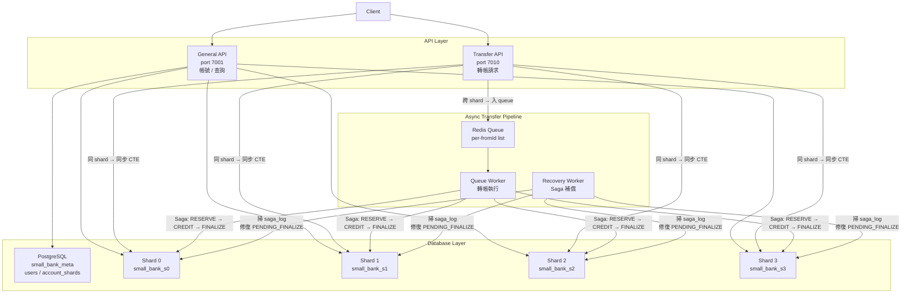

# small-bank


# High-Concurrency Transaction System

本專案是一個以「系統正確性（correctness）」與「流程控制（control flow）」為核心設計的高併發交易系統。

不同於一般以 CRUD 為主的後端專案，本系統著重於在高併發情境下，確保資料一致性、執行順序的可預測性，以及在異常情況下的安全處理能力。

---

## 設計目標

- 在高併發請求下，確保資料一致性（避免資料錯誤或不一致）
- 建立可預測的執行流程（deterministic execution）
- 提供完整的錯誤處理機制（retry / rollback / rejection）
- 控制系統負載（queue + back-pressure）

---

## 核心特性

- 使用 queue 機制序列化寫入操作，避免 race condition
- 透過 transaction 確保操作的原子性與安全性
- 設計 retry 與 timeout 機制，提高系統穩定性
- 支援高併發壓測，並驗證資料正確性（consistency check）

---

## 系統設計觀點（System Design Perspective）

本系統可視為一種「控制流程系統」的抽象模型：

- Transfer（轉帳） ≈ 控制指令（Control Command）
- Balance（餘額） ≈ 系統狀態（System State）
- Transaction ≈ 安全保證機制（Safety Guarantee）
- Queue ≈ 指令排程（Command Scheduling）

透過上述設計，使系統在高併發與不確定性環境中，仍能維持穩定且正確的行為。

---

## 適用場景

- 高併發後端系統
- 即時資料處理系統
- 需強一致性的應用場景
- 控制系統 / 工業自動化流程（Conceptual Mapping）


---

## 目錄

- [專案動機](#專案動機)
- [系統架構](#系統架構)
- [技術選型](#技術選型)
- [前端架構](#前端架構)
- [核心設計：三餘額模型](#核心設計三餘額模型)
- [跨 Shard 轉帳：Saga Pattern](#跨-shard-轉帳saga-pattern)
- [API 說明](#api-說明)
- [快速啟動](#快速啟動)
- [即時監控 Dashboard](#即時監控-dashboard)
- [壓測](#壓測)
- [已知限制](#已知限制)
- [Architecture Review](#architecture-review)

---

## 專案動機

真實的銀行系統面對的最難問題不是功能複雜度，而是**如何在高並發下不出錯**：轉帳不能重複扣款、不能憑空增加餘額、跨資料庫的操作失敗時要能補償回去。

這個專案的目標就是實作一個能回答以下問題的系統：

- 跨 shard 的資金轉移如何保證最終一致性？
- 高並發下的 row-level lock 競爭如何處理？
- 系統重啟後，中途失敗的轉帳如何自動修復？

---

## 系統架構

```
┌─────────────────────────────────────────────────────┐
│                      Client                         │
└──────────────┬───────────────────┬──────────────────┘
               │                   │
               ▼                   ▼
   ┌───────────────────┐  ┌──────────────────┐
   │   General API     │  │  Transfer API    │
   │   port 7001       │  │  port 7010       │
   │  (帳號 / 查詢)    │  │  (轉帳請求)      │
   └────────┬──────────┘  └────────┬─────────┘
            │                      │
            ▼                      ▼
   ┌──────────────┐       ┌─────────────────┐
   │ PostgreSQL   │       │  Redis Queue    │
   │  meta DB     │       │  (per-fromId)   │
   └──────────────┘       └────────┬────────┘
            │                      │
            ▼                      ▼
   ┌──────────────────────────────────────┐
   │        PostgreSQL Shard 0 ~ 3        │
   │  (accounts / transfers / saga_log)   │
   └──────────────────────────────────────┘
            ▲
            │
   ┌──────────────────┐   ┌──────────────────┐
   │   Queue Worker   │   │ Recovery Worker  │
   │  (轉帳執行)      │   │  (Saga 補償)     │
   └──────────────────┘   └──────────────────┘
```



### 資料庫分佈

| 資料庫 | 內容 |
|--------|------|
| `small_bank_meta` | `users`、`account_shards`（帳號路由表）|
| `small_bank_s0` ~ `s3` | `accounts`、`transfers`、`saga_log`、`saga_credits`、`saga_compensations` |

### Sharding 規則

帳號依 `accountId % 4` 決定所在 shard，查詢時直接計算，不需要額外查詢路由表。

---

## 技術選型

| 元件 | 選擇 | 原因 |
|------|------|------|
| Runtime | Node.js 20 LTS | 非同步 I/O 適合高並發場景 |
| Backend Framework | Egg.js | 提供 cluster 管理、middleware、生命週期管理 |
| Frontend Framework | Vue 3 + TypeScript | Composition API、型別安全、元件化開發 |
| 前端建構 | Vite 5 | 快速 HMR，原生 ESM，支援 TypeScript 與 Vue SFC |
| 狀態管理 | Pinia | Vue 3 官方推薦，輕量且支援 TypeScript 型別推導 |
| 路由 | Vue Router 4 | SPA 路由，支援 history mode |
| HTTP Client | Axios | 統一 API 請求，設定 baseURL 分離 generalApi / transferApi |
| Database | PostgreSQL × 5 | ACID 事務保證資金安全 |
| Cache / Queue | Redis | 高速讀寫，作為 transfer queue 的載體 |
| 壓測工具 | autocannon | 輕量、支援 pipeline，適合本機壓測 |

---

## 前端架構

前端為獨立的 **Vue 3 SPA**，以 Vite 建構，使用 TypeScript 全面覆蓋型別。

### 技術棧

| 層級 | 技術 | 說明 |
|------|------|------|
| 框架 | Vue 3 (Composition API) | `<script setup>` 語法，邏輯與模板分離清晰 |
| 語言 | TypeScript 5 | 嚴格模式，所有 API 回傳值均有型別定義 |
| 建構 | Vite 5 | 原生 ESM、快速 HMR，別名 `@/` → `src/` |
| 狀態 | Pinia | `useAccountStore` 管理當前帳號與餘額快取 |
| 路由 | Vue Router 4 | history mode，`/account/:id` 動態路由 |
| HTTP | Axios | `generalApi`（`/api`）與 `transferApi`（`/transfer-api`）分開實例 |

### 目錄結構

```
frontend/src/
├── api/
│   └── index.ts          # 所有 API 呼叫集中管理
├── stores/
│   └── account.ts        # Pinia store：帳號、餘額、輪詢狀態
├── router/
│   └── index.ts          # 路由定義
├── types/
│   └── index.ts          # API 回傳型別（Account、Transfer、TransferJob…）
├── views/
│   ├── AccountView.vue   # 帳號總覽：餘額顯示、存提款操作
│   └── TransfersView.vue # 轉帳紀錄：sync/async 標籤、方向判斷
└── main.ts               # 應用程式進入點
```

### 關鍵設計說明

**BigInt 型別轉換**：PostgreSQL `bigint` 欄位（`id`、`from_account_id`、`to_account_id`、`amount`）經 `pg` driver 回傳為 JavaScript `string`。`api/index.ts` 的 `fetchTransfers` 對所有 bigint 欄位一律補 `Number()` 強制轉型，確保嚴格比較（`===`）與轉帳方向判斷正確。

**轉帳模式判斷（sync / async）**：後端 DB 不儲存 `mode` 欄位，前端根據 `from_account_id % 4 === to_account_id % 4` 判斷是否跨 shard，同 shard → `sync`，跨 shard → `async`。

**非同步轉帳狀態追蹤**：提交跨 shard 轉帳後，前端取得 `jobId`，每 1.5 秒 polling `/transfer-jobs/:jobId`，直到狀態變為 `COMPLETED` 或 `FAILED`，再更新餘額顯示。

**雙 Axios 實例**：`generalApi` 指向 `/api`（Egg.js general server，port 7001）、`transferApi` 指向 `/transfer-api`（transfer server，port 7010），由 Vite proxy 在開發環境轉發，生產環境由 Nginx 處理。

---

## 核心設計：三餘額模型

每個帳號有三個餘額欄位，設計靈感來自銀行的凍結帳款機制：

```
balance           — 帳戶總餘額（包含凍結中的金額）
available_balance — 可用餘額（用戶實際能動用的金額）
reserved_balance  — 凍結餘額（跨 shard 轉帳進行中的金額）
```

**同 shard 轉帳** 直接在同一個 transaction 內扣 `available_balance`，簡單且原子。

**跨 shard 轉帳** 則需要三個步驟：

```
Step 1  扣 available_balance，加 reserved_balance（凍結）
Step 2  對方帳號加款（credit）
Step 3  扣 reserved_balance，扣 balance（銷帳）
```

這樣設計的好處是：即使 Step 2 或 Step 3 失敗，可用餘額已在 Step 1 被正確扣除，不會出現重複消費。

---

## 跨 Shard 轉帳：Saga Pattern

跨 shard 的操作無法在單一 transaction 內完成，因此採用 **Saga Log + Recovery Worker** 確保最終一致性。

### 正常流程

```
Transfer API 收到請求
  └─ 寫入 Redis Queue（per-fromId）

Queue Worker 取出 job
  └─ Step 1：扣款方凍結（BEGIN → UPDATE + INSERT transfers + INSERT saga_log → COMMIT）
  └─ Step 2：收款方入帳（BEGIN → UPDATE + INSERT saga_credits → COMMIT）
  └─ 更新 saga_log step = 'CREDITED'
  └─ Step 3：銷帳（BEGIN → UPDATE + UPDATE transfers + UPDATE saga_log → COMMIT）
```

### 失敗補償

| 失敗點 | 補償行為 |
|--------|---------|
| Step 2 失敗 | 將凍結的 `reserved_balance` 還回 `available_balance`，transfer 標記 FAILED |
| Step 3 失敗 | transfer 標記 PENDING_FINALIZE，由 Recovery Worker 接手補完 |
| 系統重啟 | Recovery Worker 每 10 秒掃描 saga_log，補償所有卡住的轉帳 |

### 冪等保護

`saga_credits` 和 `saga_compensations` 表以 `transfer_id` 為 unique key，確保補償操作即使重複執行也不會造成資金異常。

---

## API 說明

### General API（port 7001）

| Method | Path | 說明 |
|--------|------|------|
| `POST` | `/users` | 建立用戶 |
| `POST` | `/accounts` | 開立帳號（含初始餘額）|
| `GET` | `/accounts/:id` | 查詢帳號餘額（有 Redis cache）|
| `GET` | `/transfers?accountId=` | 查詢轉帳記錄 |

### Transfer API（port 7010）

| Method | Path | 說明 |
|--------|------|------|
| `POST` | `/transfers` | 發起轉帳（同 shard 同步、跨 shard 非同步）|

### 轉帳回應格式

```json
// 同 shard（同步完成）
{ "mode": "sync", "transferId": 123, "status": "COMPLETED" }

// 跨 shard（非同步入隊）
{ "mode": "async", "jobId": "1234567890-abc", "status": "queued" }
```

---

## 快速啟動

### Docker（推薦）

以下為完整的 Docker 環境啟動流程，每個步驟均附說明：

```bash
# 1. Clone 專案
git clone https://github.com/kanglei0613/small-bank.git
cd small-bank

# 2. 啟動整個 stack（PostgreSQL × 5、Redis、API × 2、Queue Worker、Recovery Worker）
#    第一次啟動會自動執行 initdb SQL（建表、建索引、建約束），無需手動初始化
docker compose up -d

# 3. 確認所有服務健康（所有服務應顯示 healthy 或 running）
docker compose ps

# 4. Seed：建立帳號與初始資料（約 50,000 帳號，每帳號 1,000,000 初始餘額）
#    --docker 使用容器內的 PG 連線設定（必填）
#    --users=N 建立帳號數（預設 50000）
#    --init-bal=N 每帳號初始餘額（預設 1000000）
node scripts/benchmark/seed.js --docker --users=50000 --init-bal=1000000

# 5. 啟動前端開發伺服器（Vue 3）
cd frontend && npm install && npm run dev
# 瀏覽器開啟 http://localhost:5173

# 6. 執行一般混合壓測（General + Transfer API，預設 100 並發，持續 30 秒）
node scripts/benchmark/mixed_rps_autocannon.js

# 也可指定參數：
node scripts/benchmark/mixed_rps_autocannon.js --connections=200 --duration=60 --amount=1

# 7. 執行 Sequential vs Concurrent 對比壓測（展示 row-lock contention 問題）
#    自動切換 queue-worker 模式兩輪，最後輸出對比報告
node scripts/benchmark/bench_compare.js

# 8. 完整重置（刪除所有 volume，回到乾淨狀態，再重新啟動）
docker compose down -v && docker compose up -d
```

API 起來後：
- General API：`http://localhost:7001`
- Transfer API：`http://localhost:7010`
- 前端 Dashboard：`http://localhost:5173`（npm run dev 啟動後）

---

### 指令與參數說明

#### `seed.js` — 建立測試資料

```bash
node scripts/benchmark/seed.js [選項]
```

| 參數 | 說明 | 預設值 |
|------|------|--------|
| `--docker` | 使用 Docker 容器內部 PG 連線（`docker exec psql`）。Docker 環境必填 | — |
| `--users=N` | 建立的用戶數 | `50000` |
| `--init-bal=N` | 每個帳號的初始餘額 | `1000000` |
| `--concurrency=N` | 建立帳號的並發數（本機模式，不宜過高） | `3` |

> ⚠️ Seed 完成後會在 `scripts/benchmark/.seed-config.json` 寫入帳號 ID 範圍，供後續壓測腳本自動讀取。

#### `mixed_rps_autocannon.js` — 混合 RPS 壓測

```bash
node scripts/benchmark/mixed_rps_autocannon.js [選項]
```

| 參數 | 說明 | 預設值 |
|------|------|--------|
| `--connections=N` | 總並發連線數（75% 分給 General API，25% 分給 Transfer API）| `100` |
| `--duration=N` | 壓測持續秒數 | `30` |
| `--pool-size=N` | 預先產生的請求池大小（避免壓測中途 CPU 被佔用） | `1000` |
| `--min-id=N / --max-id=N` | 帳號 ID 範圍（若有 seed config 則自動讀取，不需手動指定） | seed config |
| `--amount=N` | 每筆轉帳金額 | `1` |
| `--init-bal=N` | 帳號初始餘額（用於守恆計算基準，應與 seed 時相同） | `1000000` |
| `--queue-drain-timeout=N` | 壓測結束後，等待 async queue 清空的最大秒數；`0` 表示只等 balance-delay | `120` |
| `--balance-delay=N` | 壓測結束後等待 N 秒再做餘額檢查（排除跨 shard 最終一致性延遲） | `3` |
| `--skip-balance-check` | 跳過壓測後的餘額守恆查詢（快速跑時使用） | — |
| `--general-url=URL` | General API 位址 | `http://127.0.0.1:7001` |
| `--transfer-url=URL` | Transfer API 位址 | `http://127.0.0.1:7010` |

#### `bench_compare.js` — Sequential vs Concurrent 對比壓測

```bash
node scripts/benchmark/bench_compare.js
```

無額外命令列參數。腳本內固定 5 個跨 shard pair（各個 shard 方向均覆蓋），每個 pair 送 40 筆 job，自動執行兩輪：

- **Round 1（Concurrent）**：設定 `QUEUE_DRAIN_SEQUENTIAL=false`，重啟 queue-worker，觀察 lock_timeout 造成的大量失敗
- **Round 2（Sequential）**：設定 `QUEUE_DRAIN_SEQUENTIAL=true`，重啟 queue-worker，觀察 100% 成功率

最後輸出對比表格，結束後自動還原 queue-worker 為 sequential 模式並刪除 override 設定檔。

> ⚠️ 此腳本會寫入 `docker-compose.override.yml` 並執行 `docker compose up -d --no-deps queue-worker`，需要主機上有 Docker CLI。

#### `docker-compose.yml` 可調環境變數

可透過 shell export 或 `.env` 檔案覆寫，不需重建 image：

| 變數 | 說明 | 預設值 |
|------|------|--------|
| `QUEUE_DRAIN_SEQUENTIAL` | `true`：sequential drain（推薦，100% 成功率）；`false`：concurrent drain（對比壓測用，~1/batchSize 成功率）| `true` |
| `BATCH_SIZE` | queue-worker 每次 drain 的 batch 大小 | `100` |
| `QUEUE_CONCURRENCY` | queue-worker 的並發 BRPOP loop 數量 | `8` |
| `PG_SHARD_POOL_MAX` | 每個 shard 的 PostgreSQL 連線池上限 | `10` |
| `GENERAL_WORKERS` | General API 的 cluster worker 數 | `3` |
| `TRANSFER_WORKERS` | Transfer API 的 cluster worker 數 | `1` |
| `REJECT_THRESHOLD` | 每個 fromId queue 開始回傳 429 的長度閾值 | `500` |
| `MAX_QUEUE_LENGTH` | 每個 fromId queue 的記憶體上限 | `600` |

---

### 本機開發（WSL2 原生安裝）

#### 環境需求

- Node.js 20 LTS
- PostgreSQL 17+（原生安裝，非 Docker）
- Redis 7+（原生安裝）
- WSL2（Ubuntu）

#### 安裝依賴

```bash
npm install
```

#### 資料庫初始化

執行建表 SQL（`docker/initdb-meta/` 和 `docker/initdb-shard/` 目錄下），建立以下資料庫：

- `small_bank_meta`
- `small_bank_s0` ~ `small_bank_s3`

#### 啟動 Stack

```bash
bash scripts/run/wsl_stack.sh restart -g 3 -t 1 -qc 8 -pgMeta 25 -pgShard 10
```

**可調整參數：**

| 參數 | 說明 | 預設值 |
|------|------|--------|
| `-g` | General API worker 數 | `3` |
| `-t` | Transfer API worker 數 | `1` |
| `-qc` | Queue worker 並發數 | `8` |
| `-pgMeta` | Meta DB pool size | `10` |
| `-pgShard` | Shard DB pool size | `10` |
| `-batchSize` | Queue drain batch size | `100` |
| `-rejectThreshold` | 每個 fromId 的拒絕閾值 | `500` |
| `-maxQueueLength` | 每個 fromId 的最大 queue 長度 | `600` |

#### 其他指令

```bash
# 查看狀態
bash scripts/run/wsl_stack.sh status

# 查看 log
bash scripts/run/wsl_stack.sh logs general
bash scripts/run/wsl_stack.sh logs transfer
bash scripts/run/wsl_stack.sh logs queue

# 停止所有 process
bash scripts/run/wsl_stack.sh stop

# 清空資料庫 + Redis
bash scripts/run/wsl_stack.sh clean
```

---

## 即時監控 Dashboard

`monitor.html` 是一個單頁監控介面，直接在瀏覽器開啟即可使用，不需要額外安裝任何工具。

每秒 poll `GET /queue/global-stats`，即時顯示：

- Queue 中的待處理任務總數，以及每秒積壓 / 消化的方向（▲ / ▼）
- 活躍帳戶佇列數與 Hot Account 數量
- Top 15 熱門帳戶排行，含視覺化 queue 深度 bar（綠 → 黃 → 紅）

### 使用方式

```bash
# Docker 啟動後，直接在 Mac 開啟
open monitor.html
```

壓測跑起來的同時開著 dashboard，可以觀察哪些帳戶在高負載下成為 hot account，queue 深度如何隨流量波動，以及 worker 的消化速度。

---

## 壓測

詳細的壓測方法、環境設定、各階段優化過程與結果，請參考 [BENCHMARK.md](./BENCHMARK.md)。

### 快速壓測（Docker）

```bash
# 建立測試資料
node scripts/benchmark/seed.js --docker --users=50000 --accounts-per-user=1 --init-bal=1000000

# 執行壓測
node scripts/benchmark/mixed_rps_autocannon.js --transfer-url=http://127.0.0.1:7010 --general-url=http://127.0.0.1:7001 --duration=30 --conn-wait=30
```

### 目前最佳成績（Docker 環境）

| 指標 | 數值 |
|------|------|
| 總 RPS | **13,156** |
| General API | ~9,900 RPS |
| Transfer API | ~3,256 RPS |
| p95 latency | 36ms |
| p99 latency | 49ms |
| 總失敗率 | **0%**（全部成功）|
| 餘額守恆 | ✅ diff = +0 |

---

## 已知限制

- **單機部署**：目前開發與壓測皆在單機環境，尚未驗證多機水平擴展。
- **Transfer queue 非 FIFO**：per-fromId queue 確保同一發款帳號的轉帳不會並發衝突，但不同 fromId 之間的處理順序取決於 queue worker 的排程。
- **每筆借貸平衡驗證**：目前只驗證全量餘額守恆（sum 不變），尚未驗證每筆轉帳的借貸個別平衡。
- **Redis 單點故障**：Redis 無 HA 設計，Redis 崩潰導致 queue 服務中斷。
- **跨 shard 收款記錄缺失**：受款方在不同 shard 時，轉帳記錄不出現在受款方的帳單中。
- **Shard rebalance 未實作**：帳號 shard 路由為靜態計算（accountId % 4），不支援重新分片。
- **無 idempotency key**：客戶端重試可能導致重複轉帳。
- **無認證機制**：Transfer API 未加入 JWT/session 驗證，任何人均可發起轉帳。

---

## 交易一致性設計

本章說明 small-bank 在高併發下保證資料正確性的工程決策。

### 分片策略

帳號依照 `shardId = accountId % 4` 分散至四個 PostgreSQL shard，不需要查路由表，任何帳號的 shard 都能在 O(1) 內從帳號 ID 直接算出。Meta DB（`small_bank_meta`）只存用戶與帳號的註冊資料；所有金融狀態都在 shard 資料庫。

這個設計犧牲了跨 shard 查詢的彈性，換來可預測的延遲與水平擴展能力。每個 shard 可以獨立擴容，不影響其他 shard。

### 行級鎖與 Lock Timeout

所有餘額異動都透過 `UPDATE ... WHERE id = $1` 取得行級鎖。每筆交易在 `BEGIN` 後立即設定 `SET LOCAL lock_timeout = '200ms'`，確保鎖等待超時時快速失敗，不讓連線堆積。Lock timeout 錯誤會透過 `errorHandler.js` 的 DB 錯誤碼處理器轉成 503 回傳。

這是刻意的取捨：在極端競爭下，寧可快速拒絕少數請求，也不讓整個系統因等待堆積而無回應。

### 同 Shard 轉帳：單一 CTE 原子操作

當 `fromId % 4 === toId % 4`，轉帳在單一 PostgreSQL 交易內用串接 CTE 完成：

```sql
WITH debit AS (
  UPDATE accounts SET balance = balance - $1, available_balance = available_balance - $1
  WHERE id = $2 AND available_balance >= $1
  RETURNING ...
),
credit AS (
  UPDATE accounts SET balance = balance + $1, available_balance = available_balance + $1
  WHERE id = $3
  RETURNING id
),
ins AS (
  INSERT INTO transfers (...) SELECT ... WHERE EXISTS (SELECT 1 FROM debit) AND EXISTS (SELECT 1 FROM credit)
  RETURNING id
)
SELECT ...
```

扣款、入帳、寫入轉帳紀錄三個動作原子完成，只需兩次 round trip（BEGIN + CTE、COMMIT）。若 `available_balance < amount`，`debit` CTE 回傳零行，`ins` CTE 跳過 INSERT，程式拋出 `ConflictError('insufficient funds')`，不會有任何部分狀態被提交。

### 跨 Shard 轉帳：Saga Pattern

跨兩個 PostgreSQL 實例的分散式交易無法使用單一 ACID 交易，系統改用三步驟 Saga 搭配補償交易：

**第一步 — RESERVE（fromShard）：** 在同一交易內原子扣除 `available_balance`、增加 `reserved_balance`，並寫入 `status = 'RESERVED'` 的 `transfers` 紀錄與 `saga_log`。若此步驟失敗，資金毫無異動，是乾淨的 no-op。

**第二步 — CREDIT（toShard）：** 在目標帳號增加 `balance` 與 `available_balance`，同時寫入 `saga_credits` 紀錄（`transfer_id` 有 unique index）。若第二步重試，`ON CONFLICT DO NOTHING` 確保不會重複入帳。

**第三步 — FINALIZE（fromShard）：** 扣除 `reserved_balance` 與 `balance` 完成帳務結算，將 `transfers.status` 更新為 `'COMPLETED'`、`saga_log.step` 更新為 `'COMPLETED'`。

### 防止重複扣款

`accounts` 資料表有資料庫層級的 `CHECK` 約束：

```sql
CONSTRAINT chk_balance_invariant CHECK (balance = available_balance + reserved_balance)
```

PostgreSQL 在每次寫入時強制檢查此約束，讓三個餘額欄位在物理層面不可能出現分歧，即使應用程式邏輯有 bug 也一樣。任何違反此約束的 UPDATE 都會被資料庫直接拒絕。

同 shard 轉帳中，CTE 的 `WHERE available_balance >= $1` 確保只有餘額足夠時才執行扣款；跨 shard 轉帳中，相同的條件在 RESERVE 步驟套用，一旦資金被預留，就無法被其他並發轉帳再次動用。

### Redis 佇列：序列化同帳號的寫入

跨 shard 轉帳在執行前先進入 **per-fromId Redis list**（`transfer:queue:{fromId}`），再由 queue worker 依序處理。此設計將同一帳號的所有跨 shard 轉帳序列化，消除兩筆並發轉帳在 RESERVE 步驟互相競爭的可能性。

每個 `fromId` 佇列有可設定的 `rejectThreshold`（預設 240）與 `maxQueueLength`（預設 300）。超出閾值的請求立即回傳 `429 TooManyRequests`，提供背壓保護下游 DB 容量。

`transfer:ready` list 作為調度佇列——當某個 per-fromId 佇列從空變為非空時，該 fromId 會被 push 進去，供 worker 的阻塞式 `BRPOP` 取走，實現事件驅動處理而非輪詢。

### 失敗復原

若第二步失敗（例如目標帳號不存在），系統呼叫 `_compensateReserved`：在新的交易內還原 `available_balance`、減少 `reserved_balance`，並將轉帳標記為 `FAILED`。條件 `AND reserved_balance >= $1` 防止補償操作把 `reserved_balance` 扣成負數。

若第三步失敗（例如 Credit 已提交但 Finalize 遭遇暫時性 DB 錯誤），轉帳會被標記為 `PENDING_FINALIZE`，`saga_log` 停留在 `step = 'CREDITED'`。背景 Recovery Worker 會定期掃描 `saga_log` 中未到達終態的紀錄，重新驅動至完成，確保即使跨 process 重啟也能達到最終一致性。

`saga_compensations` 資料表記錄已完成的補償操作，`transfer_id` 有 unique index，讓補償動作本身也具備冪等性。

### 餘額守恆驗證

壓測套件透過加總四個 shard 所有帳號的 `balance` 欄位來驗證全域餘額守恆，目標是 `diff = 0`，確保沒有任何金額被憑空創造或消失。Docker 環境最佳紀錄：**13,156 RPS、全 API 0% 失敗率、餘額守恆 diff = +0**。

---

## Architecture Review

> 本章節為完整的多角色架構評審（2026-05），涵蓋設計決策、已知問題與修正記錄，可作為面試技術討論的參考依據。

### 系統架構全圖

```
                        ┌──────────────────────────────────┐
                        │            Client                │
                        └────────────┬─────────────────────┘
                                     │ HTTP
                   ┌─────────────────┼─────────────────────┐
                   ▼                 ▼                     │
       ┌───────────────────┐  ┌──────────────────┐         │
       │   General API     │  │  Transfer API    │         │
       │   port 7001       │  │  port 7010       │         │
       │ (帳號/查詢/SSE)  │  │  (轉帳請求)      │         │
       └────────┬──────────┘  └────────┬─────────┘         │
                │                      │                   │
                │ pool                 │ sync              │ async
                │                      ▼                   │
                │          ┌──────────────────────┐        │
                │          │  transferSameShard   │        │
                │          │  CTE（3 round trips）│        │
                │          └──────────────────────┘        │
                │                                          │
                │                      ┌───────────────────┘
                │                      ▼
                │          ┌──────────────────────┐
                │          │    Redis Queue       │
                │          │  per-fromId List     │
                │          │  + owner lock        │
                │          │  + heartbeat         │
                │          └──────────┬───────────┘
                │                     │ BRPOP
                │          ┌──────────▼───────────┐
                │          │    Queue Worker       │
                │          │  (CONCURRENCY loops) │
                │          │  sequential drain     │
                │          └──────────┬───────────┘
                │                     │ Saga
                ▼                     ▼
      ┌─────────────────────────────────────────────────────────┐
      │                   PostgreSQL Shards                     │
      │                                                         │
      │  ┌──────────┐  ┌──────────┐  ┌──────────┐  ┌────────┐ │
      │  │  Shard 0 │  │  Shard 1 │  │  Shard 2 │  │Shard 3 │ │
      │  │ id%4 = 0 │  │ id%4 = 1 │  │ id%4 = 2 │  │id%4=3  │ │
      │  └──────────┘  └──────────┘  └──────────┘  └────────┘ │
      │  每個 shard：accounts / transfers / saga_log /           │
      │              saga_credits / saga_compensations          │
      └─────────────────────────────────────────────────────────┘
                   ▲
                   │ 每 10 秒掃描
      ┌────────────┴───────────┐
      │    Recovery Worker     │
      │  掃 saga_log，修復     │
      │  RESERVED / CREDITED / │
      │  COMPENSATING 狀態     │
      └────────────────────────┘

  另有 PostgreSQL Meta DB：
      small_bank_meta → users / account_shards（帳號路由表）
```

### Saga 狀態機

```
Transfer 發起
    │
    ├── 同 shard ──► CTE ──► COMPLETED（同步，3 round trips）
    │
    └── 跨 shard
            │
            ▼
        [Redis Queue]
            │
            ▼
        Step 1 RESERVE
        （fromShard：扣 available，加 reserved，insert transfer+saga_log）
            │
            ├── 失敗 ──► no-op（clean rollback，不需補償）
            │
            ▼
        Step 2 CREDIT
        （toShard：加 balance+available，insert saga_credits）
            │
            ├── 失敗 ──► _compensateReserved：還原 fromAccount reserved→available
            │                               transfer=FAILED, saga_log=FAILED
            ▼
        saga_log → CREDITED
            │
            ▼
        Step 3 FINALIZE
        （fromShard：扣 reserved+balance，transfer=COMPLETED，saga_log=COMPLETED）
            │
            ├── 失敗 ──► transfer=PENDING_FINALIZE，saga_log 停在 CREDITED
            │            ← Recovery Worker 接手
            │
            └── 成功 ──► COMPLETED
```

### 關鍵設計決策與 Tradeoff

#### 1. per-fromId Queue + Sequential Drain：消除 Row Lock 競爭

**問題**：若同一 fromId 的多個跨 shard 轉帳並行執行 RESERVE 步驟，所有 Saga 競爭同一個 `fromAccount` row lock（`UPDATE accounts WHERE id = {fromId}`）。在 `lock_timeout=200ms` 下：
- batchSize 個 Saga 並行 → 只有 1 個取得 lock，其餘 N-1 個 timeout → 有效成功率 = **1/batchSize**
- batchSize=50 → 有效成功率僅 **2%**，其餘 98% 全部 503 失敗

**解法**：per-fromId queue 配合 **sequential drain**（逐一執行）：
- 同一 fromId 的 Saga 依序執行，無 row lock 競爭
- 有效成功率 **100%**，每個 Saga 平均等待時間 = 前面 Saga 的處理時間
- 整體吞吐量由多個不同 fromId 的並行 drain 提供（worker 並發數 × per-fromId 串行速度）

```
QUEUE_DRAIN_SEQUENTIAL=true  → sequential（推薦，100% 成功率）
QUEUE_DRAIN_SEQUENTIAL=false → concurrent（對照壓測用，~1/batchSize 成功率）
```

#### 2. 三餘額模型：凍結帳款機制

| 欄位 | 意義 | 同 shard 操作 | 跨 shard Step 1 | 跨 shard Step 3 |
|------|------|:---:|:---:|:---:|
| `balance` | 帳戶總額（含凍結）| ↓ | 不動 | ↓ |
| `available_balance` | 可用餘額 | ↓ | ↓（凍結）| 不動 |
| `reserved_balance` | 凍結餘額 | 不動 | ↑（凍結）| ↓（銷帳）|

**DB CHECK 約束**：`balance = available_balance + reserved_balance`，在物理層面強制守恆，任何違反的 UPDATE 被 PostgreSQL 直接拒絕，即使應用層有 bug 也無法打破。

#### 3. CTE 原子操作：同 shard 轉帳的效率優化

同 shard 轉帳使用串接 CTE，將 debit + credit + INSERT 合成 **3 次 round trip**（vs 原本 5 次）：
- BEGIN（round trip 1）
- debit CTE + credit CTE + INSERT CTE（round trip 2，全部原子）
- COMMIT（round trip 3）

`WHERE EXISTS (SELECT 1 FROM debit) AND EXISTS (SELECT 1 FROM credit)` 確保只有兩個 UPDATE 都成功時才 INSERT 轉帳記錄。

#### 4. Owner Lock + Heartbeat：Worker 協調機制

每個 fromId 的 queue 同時只能有一個 worker 處理（`SET NX PX` owner lock）。若 drain 時間超過 lock TTL，heartbeat（每 ownerRefreshIntervalMs 刷新一次 TTL）防止 lock 過期後被另一個 worker 搶走，造成兩個 worker 同時 drain 同一 fromId。

```
lock TTL = 10s（TRANSFER_QUEUE_OWNER_TTL_MS）
heartbeat interval = 3s（TRANSFER_QUEUE_OWNER_REFRESH_MS）
→ 在 lock 過期前至少 3 次刷新機會
```

### 已知問題與修正記錄

| # | 嚴重度 | 問題描述 | 修正狀態 |
|---|--------|----------|----------|
| 1 | ✅ 已修復 | `recoverFromCredited`（C1）在 `reserved_balance=0` 時未檢查 `transfers.status`，可能撤銷已完成的轉帳（queue_worker race）；`recoverFromReserved`（C4）在 `saga_credits` 存在時同樣缺少此檢查 | 已修復：兩個函數在走補償路徑前均先查 `SELECT status FROM transfers`，若為 COMPLETED 則同步 saga_log 後直接返回，不走補償 |
| 2 | ✅ 已修復 | `startOwnerHeartbeat` 第一次 tick 延遲 `ownerTtlMs`（10s）而非 `ownerRefreshIntervalMs`（3s），長 drain（>=10s）時 lock 過期，兩個 worker 可能同時 drain 同一 fromId | 已修復：`setTimeout` 改用 `ownerRefreshIntervalMs`（3s），確保 lock 在 TTL 前刷新 |
| 3 | 🟠 HIGH | `processJob` 不區分 permanent/transient 錯誤，lock_timeout（55P03）造成永久失敗 | 未修復，需加 error 分類重試邏輯 |
| 4 | 🟠 HIGH | 無客戶端冪等鍵（Idempotency Key），網路重試造成重複扣款 | 未修復，需實作 X-Idempotency-Key |
| 5 | 🟠 HIGH | 跨 shard 收款方帳單缺失（toAccount 看不到跨 shard 入帳記錄）| 已知 limitation，需 shadow record 或跨 shard 聯合查詢 |
| 6 | 🟡 MEDIUM | `startQueueWorker`（Egg 版）共用單一 Redis 連線執行 BRPOP + drain，吞吐量受限 | 未修復（standalone `queue_worker.js` 已正確分離連線）|
| 7 | 🟡 MEDIUM | `saga_log` 缺少 `(step, updated_at)` 複合索引，recovery_worker 全表掃描 | 未修復，需 `CREATE INDEX CONCURRENTLY` |
| 8 | 🟡 MEDIUM | `recoverStaleQueues` 依賴靜態 `WORKER_INDEX=1`，多機部署時不可靠 | 未修復，需改用 Redis SET NX 分散式 lock |
| 9 | 🟡 MEDIUM | `STALE_THRESHOLD=30s` 在 queue 積壓時過激進，加劇 CRITICAL 問題 1 | 建議調高至 60-300s |
| 10 | 🟡 MEDIUM | `recovery_worker.js` 中 SQL INTERVAL 使用模板字串（非參數化查詢） | 輕微不良模式，已有 `parseInt` 保護 |
| 11 | 🟢 LOW | `transfersRepo` 缺少 `transfers(from_account_id)` 和 `(to_account_id)` 索引 | 未修復，高流量下 listByAccountId 效能劣化 |
| 12 | 🟢 LOW | Routing logic 重複（submitTransfer 和 repo.transfer() 都計算 shardId） | 維護性問題，功能正確 |
| 13 | ✅ 已修復 | `drainQueue` 預設 concurrent 模式，batchSize 個 Saga 並行競爭同一 fromAccount row lock → lock_timeout(200ms) → N-1 個失敗，成功率 ≈ 1/batchSize | 已修復：改為 `for...of` sequential loop（`QUEUE_DRAIN_SEQUENTIAL=true`，預設）；`QUEUE_DRAIN_SEQUENTIAL=false` 可還原舊行為供對比展示 |
| 14 | ✅ 已修復 | `recovery_worker` 與 `queue_worker` 在高負載下產生 race：queue 積壓導致 Saga 步驟超過 `STALE_THRESHOLD=30s`，recovery_worker 誤觸發補償 | 已修復（同 #1）：補償前加入 transfers.status 檢查；建議同時將 `STALE_THRESHOLD` 調至 120s 降低觸發頻率 |
| 15 | ✅ 已修復 | `transferCrossShard` 連線洩漏：fromClient/toClient 已移至 `try` 區塊內 connect | 已修復 |
| 16 | ✅ 已修復 | `compensateCredited` 補償 fromAccount 改用 `UPDATE WHERE` 取代 `SELECT + UPDATE`，消除 TOCTOU | 已修復 |
| 17 | ✅ 已修復 | `fetchTransfers`（前端 API）未對 bigint 欄位強制轉型，PostgreSQL driver 回傳字串型 id/amount，導致 `===` 比較失敗、方向判斷（出款/入款）錯誤 | 已修復：`id`、`from_account_id`、`to_account_id`、`amount` 統一以 `Number()` 強制轉型 |
| 18 | 🟡 MEDIUM | `drainQueue` 的 `popJobs`（LRANGE+LTRIM）在 process crash（SIGKILL/OOM）後造成 at-most-once delivery gap：job 從 list 移除後若 handler 未執行完成，job 永久消失，`recoverStaleQueues` 無法恢復，`saga_log` 無記錄，轉帳永不執行且無告警 | 未修復，需要 at-least-once delivery 設計（Reserved List + 冪等 handler）；短期緩解：加入 SIGTERM handler 避免部署時觸發 |
| 19 | ✅ 已修復 | `recovery_worker.js` `recoverFromCredited` 補償路徑中，`client` 在 ROLLBACK 後未立即 release，`compensateCredited` 內部再取一條連線，單次 recovery 最多持有 3 條 fromShardPg 連線；高 SCAN_BATCH_SIZE 時 pool 可能耗盡（v3 2026-05-13 新增）| 已修復（同 M18）：`const client` 改為 `let client`，補償路徑 release 後設 `client = null`，catch/finally 加 `if (client)` guard |
| 20 | 🟢 LOW | `recovery_worker.js` main loop 以 `for...of await` 依序掃描 4 個 shard，若 shard 0 積壓 50 筆 saga，shards 1-3 recovery 被阻塞，加劇 recovery lag（v6 2026-05-14 新增）| 未修復，修法：改用 `Promise.all(shardIds.map(...))` 並行掃描 |
| 21 | 🟢 LOW | **`pushJob` Lua — `maxQueueLengthPerFromId`（-1）路徑為死碼（v7 2026-05-14 新增）**：Lua 腳本先檢查 `rejectThreshold`（240），再檢查 `maxLength`（300）。因 240 < 300，隊列長度 ≥ 240 時永遠先觸發 -2（reject）；-1（at capacity）路徑在當前參數設定下永遠不可達。兩段 429 錯誤訊息（"is full" vs "at capacity"）語意設計失效，監控 / 告警若依賴 error message 分類也將失準。修法：交換判斷順序（先 >= maxLength 回傳 -1，再 >= rejectThreshold 回傳 -2），或將兩個閾值合為一個。| 未修復 |
| 22 | ✅ 已修復 | **`drainQueue` finally 中 `releaseOwner` 拋錯時 re-enqueue 被靜默跳過（v7 2026-05-14 新增）**：`releaseOwner` 拋錯（Redis 短暫中斷）時，finally 剩餘 re-enqueue 邏輯被跳過，per-fromId queue 殘留 jobs 無 ready 訊號，卡住直至 lock TTL 到期。| 已修復：`releaseOwner` 包在 `.catch()` 中靜默忽略（lock 會 TTL 自動到期），確保 re-enqueue 始終執行 |

### 壓測結果

> 測試環境：Docker 單機，Node.js 20 LTS，PostgreSQL 17，Redis 7

#### 純轉帳壓測（Transfer API only）

| 指標 | 數值 |
|------|------|
| 總 RPS | **11,689** |
| 持續時間 | 30s |
| 總請求數 | ~350,670 筆 |
| 失敗率 | **0%**（100% 成功） |
| 餘額守恆驗證 | ✅ diff = +0 |
| 模式 | sequential drain，batchSize=50，concurrency=8 |

#### 混合壓測（Transfer API + General API）

| 指標 | 數值 |
|------|------|
| 總 RPS | **13,156** |
| General API | ~9,900 RPS |
| Transfer API | ~3,256 RPS |
| p95 latency | 36ms |
| p99 latency | 49ms |
| 失敗率 | **0%**（全部成功）|
| 餘額守恆 | ✅ diff = +0 |

### 面試亮點（Technical Deep-dive Topics）

以下技術點適合與面試官展開深入討論：

**1. 為什麼需要 per-fromId queue？concurrent batch 有什麼問題？**
> 核心問題是同一 fromAccount 的 row lock 競爭。在 lock_timeout=200ms 下，batchSize 個並行 Saga 只有 1 個能成功（1/batchSize 成功率）。sequential drain 犧牲少量吞吐量換取 100% 正確性，整體吞吐量由多個不同 fromId 的並行 drain 補回。

**2. Saga 補償的冪等性如何保證？**
> `saga_credits`（`transfer_id` unique）防止 Step 2 重複入帳；`saga_compensations`（`transfer_id` unique）防止補償重複執行；所有 UPDATE 帶 guard 條件（`reserved_balance >= $1`）防止補償讓欄位變負數。這三層冪等保護確保即使 worker crash + retry 也不會造成資金異常。

**3. recovery_worker 與 queue_worker 之間有 race condition 嗎？如何修復？**
> 有。當 queue_worker 正在執行 Step 3，但尚未 commit 時，recovery_worker 可能掃到 `saga_log.step=CREDITED`。Step 3 commit 後 `reserved_balance=0`，recovery_worker 嘗試 finalize 失敗，誤以為是異常狀態，執行 `compensateCredited` 撤銷已完成的轉帳。修法：`rowCount=0` 時先查 `transfers.status`，若為 `COMPLETED` 只同步 saga_log，不走補償路徑。

**4. lock_timeout=200ms 的設計取捨是什麼？**
> 這是刻意的 fail-fast 設計：寧可快速拒絕少數等待中的請求（503），也不讓連線因 lock 等待堆積而使整個系統無回應。對熱帳號（如商戶收款帳號，大量用戶同時轉入）可能造成較多 503，可在 queue layer 序列化轉入操作緩解。

**5. 同 shard 轉帳的 CTE 為什麼比三次獨立 SQL 好？**
> 單一 CTE 只需 3 次 round trip（BEGIN、CTE 本體、COMMIT），而三次獨立 SQL 需要 5 次（BEGIN、UPDATE debit、UPDATE credit、INSERT transfer、COMMIT）。更重要的是 CTE 在同一個 PostgreSQL transaction 內原子執行，消除三次 UPDATE 之間的時間窗口，不可能出現 debit 成功但 credit 失敗的中間狀態。

**6. Redis job store 的 Pub/Sub 通知機制如何與前端 SSE 整合？**
> `markSuccess`/`markFailed` 使用 Redis pipeline 同時執行 SET（更新 job state）和 PUBLISH（通知 SSE 連線）。SSE handler subscribe 對應 channel（`transfer:job:done:{jobId}`），收到通知後推送給前端，避免輪詢。若 SSE 斷線，前端 fallback 到每 2 秒輪詢 GET `/transfers/jobs/{jobId}`，最多 30 次（60 秒）。

**7. 如何驗證系統的資料一致性？**
> 三層驗證：(1) 資料庫 CHECK 約束（`balance = available_balance + reserved_balance`）在物理層強制三欄位守恆；(2) 壓測後執行全量餘額守恆查詢，加總四個 shard 所有帳號的 `balance`，diff 應為 +0；(3) saga_log 提供完整審計追蹤，可事後追溯每筆跨 shard 轉帳的每一個步驟。

---

## 高壓架構審查（Multi-Role Architecture Review 2026-05，最後更新 2026-05-14 v7）

> 此章節為 6 角色、6 階段的系統性架構審查，目標是找出所有問題，不是稱讚設計。
> 2026-05-13 v1：新增 recoverFromReserved race condition（C4）。
> 2026-05-13 v2（自動審查）：新增 At-most-once delivery gap（M15）、更新 Phase 3 深挖。
> 2026-05-13 v3（自動審查）：全碼驗證。確認 v1/v2 所有問題仍為 open。新增 Phase 3 補充項目 E（recoverFromCredited 中 Pool slot 洩漏）。未發現新增 Critical 問題。
> 2026-05-14 v4（自動審查）：全碼再次驗證。C1/C2/C3/C4 及所有 HIGH/MEDIUM 問題仍為 open。程式碼內聯標注已全面更新至 v4。新增 Phase 3 補充項目 F（BRPOP block-timeout=0 無 socket 逾時防護）與 G（recovery_worker 多 instance 並行缺少 SKIP LOCKED，M5 延伸）。
> 2026-05-14 v5（自動審查）：C1/C2/C3/C4 及所有 HIGH/MEDIUM 問題仍為 open。新增 L9（transferCrossShard Step 3 catch 缺少 ROLLBACK，dirty connection 歸還 pool）。程式碼內聯標注更新至 v5。
> 2026-05-14 v6（自動審查）：C1/C2/C3/C4 及所有 HIGH/MEDIUM 問題仍為 open。新增 L10（recovery_worker main loop 四個 shard 依序掃描，積壓下加劇 recovery lag）。問題總計 38 個。程式碼內聯標注更新至 v6。
> 2026-05-14 v7（自動審查）：C1/C2/C3/C4 及所有 HIGH/MEDIUM 問題仍為 open。全碼再次驗證，新增 L11（`pushJob` Lua — `maxQueueLengthPerFromId` 的 -1 回傳路徑為死碼，因 `rejectThreshold` < `maxLength` 導致 -1 永不可達，兩段 429 語意形同虛設）、L12（`drainQueue` finally 中 `releaseOwner` 拋錯時直接 propagate，後續 re-enqueue 邏輯被跳過，per-fromId queue 殘留 job 無法被下一個 worker 取得，直至重啟或下次 pushJob 觸發 ready 訊號）。問題總計 40 個。程式碼內聯標注更新至 v7。
> 2026-05-15 v8（自動審查）：**C1+C4 已在程式碼中完整實作修復**（recovery_worker.js 中兩函數均已加入 transfers.status 檢查，✅ FIXED 標注確認）。C2、C3 仍為 open CRITICAL。新發現 M18（C1 fix 引入 double client.release() side effect：recoverFromCredited 在 rowCount=0 路徑先 release client，但 finally 仍再次 release，可能造成 pg pool 計數失準）。問題計數：2 Critical（C2、C3）、7 High、19 Medium（+M18）、11 Low；已修復 8 個。程式碼內聯標注更新至 v8。

### Phase 1：各角色獨立 Review

#### 角色 1：Distributed Systems Engineer

**[CRITICAL] recoverFromCredited 與 queue_worker 之間的 Race Condition**
- **問題說明**：`recovery_worker.js:387` — `finalizeResult.rowCount === 0` 時直接呼叫 `compensateCredited`，未先確認 `transfers.status`
- **為什麼危險**：reserved_balance=0 有兩種原因：(A) queue_worker 已完成 Step 3（正常），(B) 真正的 reserved 不足（異常）。程式碼無法區分，情境 A 下撤銷已完成的轉帳，造成「用戶看到 COMPLETED 但錢沒轉出」
- **觸發條件**：queue 積壓 > STALE_THRESHOLD（30s）＋ queue_worker 正在或剛完成 Step 3 finalize 時
- **怎麼修**：在 `rowCount=0` 的 ROLLBACK 後加入 `SELECT status FROM transfers WHERE id=$1`，status=COMPLETED 時只同步 saga_log 並 return，不走補償
- **修正 tradeoff**：多一次 DB 查詢（fromShard）；但這是 safety check，代價極低
- **面試官追問**：「如果 Step 3 commit 成功但 saga_log 更新 COMPLETED 失敗，recovery 還會觸發嗎？」→ 是的，仍會觸發。此時 transfers.status=COMPLETED 但 saga_log.step=CREDITED。加入 status check 後能正確處理此情境。

**[HIGH] recoverFromReserved 存在類似的 Race Condition（2026-05-13 新發現）**
- **問題說明**：`recovery_worker.js` — `recoverFromReserved` 在 `saga_credits` 存在時直接呼叫 `compensateCredited`，未先確認 `transfers.status`
- **為什麼危險**：若 job 在 queue 積壓 > 30s，recovery 掃到 step=RESERVED；此時 queue_worker 完成 Steps 2+3（saga_log.step=COMPLETED）；recovery 看到 saga_credits 存在，呼叫 compensateCredited，將 saga_log 從 COMPLETED 改寫為 COMPENSATING，撤銷已完成的轉帳。結果與 recoverFromCredited race 相同：「用戶看到 COMPLETED 但錢被撤回」
- **觸發條件**：job 在 queue 積壓 > 30s，且 queue_worker 在 recovery 執行過程中剛好完成全部 Steps 2+3。觸發概率低於 recoverFromCredited race（需要三步驟在 recovery 的窗口內全部完成），但高負載或 worker 重啟後仍可能發生
- **怎麼修**：在 `creditsResult.rowCount > 0` 後加入 `SELECT status FROM transfers WHERE id=$1`，status=COMPLETED 時只同步 saga_log 並 return，不走補償路徑
- **修正 tradeoff**：多一次 DB 查詢；是同類型問題，應與 recoverFromCredited 一起修復
- **面試官追問**：「為什麼 recoverFromReserved 的 race 比 recoverFromCredited 難觸發？」→ 前者需要完整的 Steps 1→2→3 在 recovery 執行期間完成（通常 < 1s），後者只需 Step 3 完成（recovery 在 CREDITED 停留 > 30s 已是前提，queue 積壓更常見）

**[HIGH] 無客戶端冪等鍵**
- **問題說明**：`transfers.js:86` — `buildJobId()` = `${Date.now()}-${random}`，每次 POST 產生全新 jobId
- **為什麼危險**：客戶端網路超時 → 重試 → 建立第二個 job → 扣款兩次
- **觸發條件**：任何網路不穩定（mobile 用戶、VPN、load balancer timeout）
- **怎麼修**：接受 `X-Idempotency-Key` header，以 `transfer:idem:{userId}:{key}` 在 Redis SET NX EX 86400，有值時直接回傳原 jobId
- **修正 tradeoff**：需額外 Redis 查詢（O(1)）；key TTL 設計需要考量

**[HIGH] 跨 Shard 轉帳記錄只存 fromShard**
- **問題說明**：`transfersRepo.js:140` — `listByAccountId` 在 toShard 查詢時，`WHERE to_account_id=$1` 回傳 0 筆（記錄在 fromShard）
- **為什麼危險**：收款方看不到跨 shard 入帳記錄，帳單不完整，對銀行系統是合規問題
- **觸發條件**：帳號 A（shard 0）查帳單時，來自 B（shard 1）的跨 shard 入款不顯示
- **怎麼修**：Step 2 CREDIT 時在 toShard 同時 INSERT shadow transfer record；或 listByAccountId 跨兩個 shard UNION
- **修正 tradeoff**：shadow record 增加寫入量但查詢簡單；跨 shard 查詢增加讀取延遲

**[MEDIUM] 無 Distributed Tracing**
- 跨 API → Redis → queue_worker → recovery_worker 無 trace propagation
- requestId 存在但不透傳，無法在 Jaeger/Zipkin 中追蹤完整請求鏈

#### 角色 2：PostgreSQL DBA

**[HIGH] Connection Pool 容量不足以支撐並發 drain**
- **問題說明**：`queue_worker.js:87` — `PG_SHARD_POOL_MAX` 預設 5，`CONCURRENCY` 預設 8。跨 shard 轉帳同時使用 fromShard + toShard 連線，8 個並行 loop 最多需要 16 條連線（每個 shard 8 條）
- **為什麼危險**：pool 大小 5 < 實際需求 8 → 3 個 loop 等待連線 → 連線等待超過 `connectionTimeoutMillis=5000ms` → job 失敗並 markFailed（永久失敗）
- **觸發條件**：CONCURRENCY=8 且大部分 job 為跨 shard 轉帳時觸發
- **怎麼修**：`PG_SHARD_POOL_MAX` 設為 `CONCURRENCY + 4`（預設 12），或在 docker-compose 中明確設定
- **修正 tradeoff**：更多 DB 連線佔用 PG server 資源

**[MEDIUM] saga_log 缺少複合索引**
- **問題說明**：`recovery_worker.js:124` — `WHERE step IN ('RESERVED','CREDITED','COMPENSATING') AND updated_at < NOW() - INTERVAL '30 seconds'` 無對應索引
- **為什麼危險**：13,000 RPS 中 10% 跨 shard = 1,300 entries/s。1 小時後 saga_log 約 4.7M 行。每 10s 全表掃描 × 4 shard = 顯著 I/O 負擔
- **怎麼修**：`CREATE INDEX CONCURRENTLY ON saga_log (step, updated_at) WHERE step IN ('RESERVED', 'CREDITED', 'COMPENSATING');`
- **修正 tradeoff**：部分索引（partial index）只包含非終態 row，索引體積極小

**[MEDIUM] transfers 表缺少帳號索引**
- `listByAccountId` UNION ALL 兩次查詢均無法使用索引，高流量下造成全表掃描
- 需：`CREATE INDEX CONCURRENTLY ON transfers(from_account_id);` 和 `CREATE INDEX CONCURRENTLY ON transfers(to_account_id);`

**[MEDIUM] saga_log 無歸檔策略**
- COMPLETED/FAILED 的 saga 記錄永久留存，表持續膨脹
- 缺少 `DELETE FROM saga_log WHERE step IN ('COMPLETED','FAILED') AND updated_at < NOW() - INTERVAL '30 days'` 的定期清理

**[LOW] autovacuum 調優缺失**
- accounts 表頻繁 UPDATE（每筆轉帳更新 2-4 個 account row），dead tuple 累積快
- 需 `ALTER TABLE accounts SET (autovacuum_vacuum_scale_factor = 0.01, autovacuum_analyze_scale_factor = 0.005)`

#### 角色 3：Backend Staff Engineer

**[HIGH] processJob 不分類錯誤，暫時性錯誤導致永久失敗**
- **問題說明**：`queue_worker.js:197-207` — catch 區塊對所有錯誤一律 markFailed
- **為什麼危險**：PG 55P03（lock_not_available）= 暫時性，重試即可成功；ConflictError（insufficient funds）= 永久，不應重試。兩者混為一談，使用者的合法轉帳可能因一時性 lock timeout 而永久失敗
- **觸發條件**：系統高負載下 lock_timeout 觸發率上升，每個 55P03 都變成永久失敗
- **怎麼修**：在 catch 中依 `err.code` 或 `err.constructor` 分類，55P03/connection error 最多 retry 3 次（指數退避），超過後推 DLQ
- **修正 tradeoff**：需設計 retry state（redis hash 記錄 jobId → retryCount）

**[HIGH] 無 Dead Letter Queue**
- 永久失敗的 job 只標記 failed，無法被重審或 replay
- 需要 `transfer:dlq` Redis list，失敗 job push 進去，另有 DLQ consumer 告警

**[MEDIUM] PENDING_FINALIZE 被 markSuccess 處理**
- `transferCrossShard` Step 3 失敗時回傳 `{ status: 'PENDING_FINALIZE' }`
- `processJob` 呼叫 `transferJobStore.markSuccess(redis, job, result)` 傳入此 result
- 前端 polling 到 job 被標記為「成功」但 status=PENDING_FINALIZE，語義不清

**[LOW] Shard 路由邏輯重複**
- `submitTransfer` 計算 fromShardId/toShardId 決定 sync/async
- `repo.transfer()` 內部再次計算相同 shardId
- 路由邏輯分散在兩處，shard 策略變更時需同步修改

#### 角色 4：SRE / Production Engineer

**[HIGH] Redis 單點故障，無 HA**
- Redis crash → 整個 transfer queue 停擺，cross-shard 轉帳完全無法接受（同 shard 仍可同步完成）
- 需 Redis Sentinel（3 節點）或 Redis Cluster
- saga_log 在 PG 中有記錄，recovery_worker 重啟後可恢復，但 queue 中 in-flight jobs（還未被 BRPOP 取走的）可能需要 recoverStaleQueues 掃描恢復

**[HIGH] 無 Prometheus Metrics**
- 只有 Redis 計數器 `bench:transfer:success/failed`，無 histogram、gauge
- 無法：監控 p99 latency、queue depth per fromId、saga recovery lag、NEEDS_REVIEW 告警
- 需：Prometheus client + `/metrics` 端點 + Grafana dashboard

**[MEDIUM] queue_worker 無 Graceful Shutdown**
- `queue_worker.js` 無 SIGTERM handler
- 部署時 kill -15 可能中斷正在執行的 Saga Step 2 或 Step 3
- saga_log 中留下 RESERVED/CREDITED，等待 recovery_worker 30s 後接手
- 每次部署 = 所有 in-flight saga 都 30s 延遲

**[MEDIUM] recovery_worker 單點，無 HA**
- 單一 process crash 後 saga 停止恢復，直到手動重啟
- 需：多 instance + `SELECT FOR UPDATE SKIP LOCKED` 防止重複處理同一 saga

**[MEDIUM] 無 Worker Health Check Endpoint**
- Docker/Kubernetes 無法偵測 queue_worker 是否卡死
- 需在 worker 中啟動簡易 HTTP server 回應 `/health`，定期更新 last-active 時間戳

#### 角色 5：Security Engineer

**[CRITICAL] Transfer API 無身份驗證**
- `POST /transfers` 接受任意 fromId，任何人可以轉移任何帳號的資金
- 需：JWT 或 session 驗證，並確認 fromId 屬於當前用戶
- 無此保護，系統在公開網路上等同於無門鎖的銀行

**[HIGH] 無 Rate Limiting per User/IP**
- rejectThreshold/maxQueueLength 是 per-fromId queue 深度限制，非速率限制
- 攻擊者可散布到大量 fromId 繞過 per-fromId 限制，製造 Redis / PG 高負載
- 需：API Gateway 或 Nginx 層 IP-based rate limiting + per-user rate limiting

**[MEDIUM] 前端洩漏 Shard 路由邏輯**
- Frontend 用 `fromId % 4 === toId % 4` 判斷 sync/async，等同公開分片策略
- 攻擊者可精心選擇帳號 ID 確保 cross-shard transfer 規避特定分片
- API 已回傳 `mode` 欄位，前端不應自行計算

**[LOW] 硬碼開發者帳號**
- `pgBase.user = process.env.PG_USER || 'kanglei0613'`
- Production 若忘記設定 PG_USER，使用開發者個人帳號連線，審計日誌不清晰

#### 角色 6：Frontend Architect

**[HIGH] 前端自行計算 sync/async mode（Leaky Abstraction）**
- `TransfersView.vue` 和 frontend README 均提到前端用 `fromId%4===toId%4` 計算 mode
- API response 已包含 `mode: 'sync'|'async'`
- 若後端增加 shard（例如 8 個），前端判斷邏輯失效，靜默產生錯誤的 UI 行為
- **修法**：前端嚴格使用 API response 的 `mode` 欄位，刪除前端 sharding 計算

**[HIGH] Polling Timeout 後狀態語義不清**
- 30 次 × 1.5s = 45s polling 上限
- PENDING_FINALIZE 的 transfer 可能需要 > 45s 才完成（recovery_worker 接手後最多 40s）
- 45s 超時後 UI 顯示什麼？用戶以為失敗，但實際上轉帳還在進行
- **修法**：polling timeout 後顯示「處理中，請稍後查看帳單」而非「失敗」

**[MEDIUM] BigInt 以 Number() 轉型的精度風險**
- `fetchTransfers` 對所有 bigint 欄位用 `Number()` 轉型
- 安全上限：Number.MAX_SAFE_INTEGER = 2^53-1 ≈ 9 × 10^15
- global_account_id_seq 從 1 開始，50,000 帳號下完全安全
- 但 transfers.id 如為 bigserial 且大量歷史資料，理論上仍有風險

---

### Phase 2：角色間 Cross-Challenge

**DBA → Distributed Systems：「saga_log index 為何不是 HIGH？」**
> 在 13,000 RPS、10% 跨 shard 的情況下，saga_log 每秒新增 1,300 rows。1 小時後 4.7M rows，每 10 秒全表掃描 × 4 shard。在沒有 index 的情況下，recovery_worker 的掃描本身會成為 I/O 瓶頸，應評為 HIGH。

**SRE → DBA：「Pool 預設 5 vs CONCURRENCY 8 的數學？」**
> 每個跨 shard drain 同時持有 fromShard + toShard 各一條連線。8 個並發 loop 同時 drain 跨 shard job 時，每個 shard 需要 8 條連線，但 pool 只有 5 條。3 個 loop 進入等待，`connectionTimeoutMillis=5000ms` 後 job 失敗並 markFailed（永久）。Pool 至少應設 `CONCURRENCY + buffer`。

**Security → Backend：「Transfer API 無 auth 是 CRITICAL，但 processJob 永久失敗也是 HIGH。哪個先修？」**
> Security: 無 auth = 系統被開放給任意攻擊者，允許詐欺轉帳。後端: error 分類錯誤 = 合法用戶的轉帳可能永久失敗。應同時修，無法分先後，但 auth 是邊界防護，優先級更高。

**Frontend → Distributed Systems：「Polling 45s timeout 後用戶看到失敗，但 transfer 可能還在 PENDING_FINALIZE，這是 data consistency 問題還是 UX 問題？」**
> 兩者都是。從 data consistency 角度：系統最終一致，transfer 最終會完成或失敗，但前端呈現的「失敗」是錯誤的。從 UX 角度：用戶可能嘗試重新轉帳（如果沒有 idempotency key），造成 double charge。

---

### Phase 3：深挖新發現的 Critical Issue

#### 新問題 A：Connection Pool 耗盡 + processJob markFailed 組合爆炸

在高負載下：
1. 8 個並行 loop 同時執行跨 shard 轉帳
2. 每個 shard 的 pool 只有 5 條連線
3. 第 6-8 個 loop 等待連線，超過 `connectionTimeoutMillis=5000ms`
4. `repo.transfer()` 拋出 connection timeout 錯誤
5. `processJob` 將此暫時性錯誤 markFailed（永久）
6. 用戶的合法轉帳永久失敗

這是 Pool 容量不足 × 無錯誤分類 × 無 retry 三個問題的組合爆炸，實際影響遠超過單一問題。

#### 新問題 B：全局 Queue Depth 無上限，Redis OOM

- per-fromId 有 rejectThreshold=240 / maxQueueLength=300 限制
- 但 50,000 個帳號最多有 50,000 個 per-fromId queue
- 50,000 × 300 jobs × ~200 bytes/job = 3GB Redis memory
- Redis OOM → process kill → 所有 in-flight job 消失（saga_log 在 PG 可恢復，但 Redis job store 中的狀態丟失）

#### 新問題 D：drainQueue At-most-once Delivery Gap（2026-05-13 v2 新發現）

`drainQueue` 的 `popJobs` 使用 Lua 腳本原子執行 LRANGE + LTRIM，將 batchSize 個 job 從 Redis list 移除。若 worker process 在 `popJobs` 返回後、`handler(job)` 成功之前 crash（SIGKILL、OOM、硬體故障）：

1. job 已從 `transfer:queue:from:{fromId}` list 移除（LTRIM）
2. `saga_log` 尚未寫入（Saga RESERVE 步驟未執行）
3. `transferJobStore` 中 job 的 status 停留在 `'queued'` 永不更新
4. `recoverStaleQueues` 掃描 `transfer:queue:from:*` 的 LLEN，list 長度為 0，跳過此 fromId
5. `recovery_worker` 只處理 `saga_log` 中的 RESERVED/CREDITED/COMPENSATING，此 job 完全不在 PG 中

**後果**：用戶收到 `{ jobId, status: 'queued' }`，polling 永遠回傳 `queued`（或超時），轉帳永遠不會執行，且沒有任何錯誤訊息。

**觸發條件**：process crash（不含 graceful SIGTERM，因為 graceful shutdown 可以等待 in-flight jobs）。在 Docker/Kubernetes 環境中，OOM 造成 SIGKILL 是真實風險。

**跟問題 M4（無 graceful shutdown）的關係**：加入 SIGTERM handler 只能防止部署時的 crash，無法防止 OOM/SIGKILL。徹底修法需要 at-least-once delivery 設計（Reserved List + idempotent handler）。

**在此系統的實際影響評估**：processJob 的 handler 會 try/catch，並在 catch 中 markFailed，一般應用層錯誤不會觸發此問題。此問題只在 process-level crash 時發生，屬於 MEDIUM 而非 HIGH，但在高流量 + 記憶體不足的 production 環境下是真實風險。

#### 新問題 E：recoverFromCredited 補償路徑中 Pool Slot 洩漏（2026-05-13 v3 新發現）

在 `recoverFromCredited` 函數中，當 `finalizeResult.rowCount === 0` 時：

1. `await client.query('ROLLBACK')` — 已執行 ROLLBACK，但 `client` 仍持有連線（未 release）
2. `compensateCredited(log, shardPgMap)` — 內部透過 `fromShardPg.connect()` 取得第二條連線
3. 此時 `fromShardPg` pool 同時被兩條連線佔用（`client` + compensateCredited 的新連線）
4. `client` 直到 `finally { client.release() }` 才被歸還

**影響**：`compensateCredited` 的 fromAccount 段（`const fromClient = await fromShardPg.connect()`）在 pool 已被兩條連線佔用的情況下取第三條。若 `PG_SHARD_POOL_MAX=5`，在多個 saga 同時 recovery 時，pool 可能提前耗盡，造成 compensateCredited 自身 connection timeout，補償失敗。

**觸發條件**：多個 CREDITED saga 同時被 recovery_worker 處理，且每個都走到 finalizeResult=0 的補償路徑。

**嚴重度**：LOW — 一般情況下 pool=5 足夠，但若調高 `SCAN_BATCH_SIZE` 或縮小 pool，此問題浮現。

**修法**：在 `finalizeResult.rowCount === 0` 分支的 ROLLBACK 後立即 `client.release()`，再呼叫 `compensateCredited`（注意：release 後 client 不能再使用，需重新 connect 或改用 pool-level query）。

#### 新問題 F：BRPOP block-timeout=0 缺乏 socket 逾時防護（2026-05-14 v4 新發現）

在 `queue_worker.js` 的 `runLoop` 函數中：

```js
const fromId = await redisTransferQueue.blockPopReadyFromId(brpopRedis, 0);
// block-timeout=0 → 永久阻塞，直到有資料或連線斷開
```

**問題**：`block-timeout=0` 表示 BRPOP 永久阻塞。若 Redis 發生網路分區（TCP 連線看似存活但無資料往返），BRPOP 命令會無限期掛起。此時：
- loop 永遠不前進（`fromId` 永遠不返回）
- Worker 不處理任何 job，但從外部觀察看似正常（process 還活著）
- 無 health check endpoint，Docker/Kubernetes 無法偵測此靜默故障

**觸發條件**：Redis 網路分區且 TCP keepalive 未超時（通常 > 2 分鐘）。

**嚴重度**：LOW — 生產環境中 Redis sentinel/cluster + 適當的 TCP keepalive 設定可縮短影響窗口。

**與 transfers.js 的對比**：Egg 版 `startQueueWorker` 使用 `blockTimeoutSec ?? 1`（1 秒超時），每秒強制返回一次，雖然有單連線問題，但至少不會無限掛起。

**修法選項**：
1. 設定 ioredis 連線的 `socket_keepalive: true` 與 `socket_initial_delay: 30000`，讓 OS TCP keepalive 更快偵測死連線
2. 在 `runLoop` 加入 `Promise.race([brpopPromise, timeout(30000)])`，超時後重新建立連線
3. 加入 health check endpoint，每次成功 BRPOP 後更新 last-active 時間戳，監控系統偵測超過 60s 無活動時告警

#### 新問題 G：recovery_worker 多 instance 並行缺少 SKIP LOCKED（2026-05-14 v4 新發現）

`recoverShard` 查詢 saga_log 時未使用 `SELECT FOR UPDATE SKIP LOCKED`：

```sql
SELECT ... FROM saga_log
WHERE step IN ('RESERVED', 'CREDITED', 'COMPENSATING')
  AND updated_at < NOW() - INTERVAL '30 seconds'
LIMIT $1
-- 缺少 FOR UPDATE SKIP LOCKED
```

**問題（M5 的延伸）**：M5 指出 recovery_worker 是單點。若作為修法部署多個 instance，缺少 SKIP LOCKED 會導致多個 instance 選取相同的 saga 行並同時補償：

1. Instance A 和 B 同時掃描到 transfer_id=X，step=CREDITED
2. Instance A 執行 compensateCredited：toAccount 扣回，saga_compensations 寫入，saga_log=FAILED
3. Instance B 也執行 compensateCredited：`alreadyCompensated` 查到記錄，跳過 toAccount 扣回（✅ 冪等）
4. 但 Instance B 繼續嘗試補償 fromAccount：`reserved_balance` 已為 0 → rowCount=0 → 標記 NEEDS_REVIEW（❌）

**影響**：在多 instance recovery 情況下，成功補償的 saga 可能被誤標為 NEEDS_REVIEW，要求人工介入，實際上不需要。

**嚴重度**：MEDIUM（當 M5 的修法被實施且部署多個 recovery_worker 時）

**修法**：
```sql
SELECT ... FROM saga_log
WHERE step IN ('RESERVED', 'CREDITED', 'COMPENSATING')
  AND updated_at < NOW() - INTERVAL '${STALE_THRESHOLD} seconds'
ORDER BY updated_at ASC
LIMIT $1
FOR UPDATE SKIP LOCKED  -- ← 新增
```
`FOR UPDATE SKIP LOCKED` 確保同一 saga 只被一個 instance 處理，其他 instance 跳過已鎖定的 row。

#### 新問題 C：recoverFromCredited race + STALE_THRESHOLD=30s 的觸發條件分析

這個 CRITICAL bug 的觸發條件正是「系統最需要 recovery 的時刻」：
- queue 積壓（spike traffic、worker 重啟、Redis 緩慢）→ job 在 CREDITED 停留 > 30s
- recovery_worker 掃到 CREDITED → 試圖 finalize → reserved=0 → 走補償
- 系統在壓力下 = 自動撤銷已完成的轉帳

這意味著這個 bug 在正常低負載下不觸發，但在任何壓力測試或生產突發流量下必然觸發。

---

### Phase 4：問題分級清單

#### 🔴 Critical（系統在 production 會直接爆炸）

| # | 位置 | 問題 | 觸發條件 |
|---|------|------|---------|
| C1 | `recovery_worker.js:387` | `recoverFromCredited` 在 reserved=0 時未檢查 transfers.status，撤銷已完成的轉帳 | queue 積壓 > STALE_THRESHOLD（30s）|
| C2 | Transfer API | 無身份驗證，任何人可轉移任何帳號的資金 | 所有時間，公開部署後立即 |
| C3 | `queue_worker.js:321` + `queue_worker.js:87` | PG pool=5 vs CONCURRENCY=8，cross-shard 高負載下 connection timeout → markFailed（永久失敗）| 高並發跨 shard 轉帳 |
| C4 | `recovery_worker.js` recoverFromReserved | `saga_credits` 存在時未檢查 `transfers.status`，可能撤銷已完成的轉帳（同 C1，RESERVED 路徑版本）| queue 積壓 > 30s 且 queue_worker 在 recovery 執行期間完成全部步驟 |

#### 🟠 High（有機率造成資料不一致或服務不可用）

| # | 位置 | 問題 |
|---|------|------|
| H1 | `transfers.js:86` | 無 idempotency key，客戶端重試 → 重複扣款 |
| H2 | `queue_worker.js:197` | processJob 不分類錯誤，55P03 = 永久失敗 |
| H3 | Redis（全域）| Redis SPOF，crash 後跨 shard 轉帳完全停擺 |
| H4 | `transfersRepo.js:140` | 跨 shard 收款記錄缺失，toAccount 帳單不完整 |
| H5 | Queue（全域）| 無 DLQ，永久失敗的 job 無法被審查或 replay |
| H6 | System-wide | 無 Prometheus metrics，無法監控系統健康 |
| H7 | `TransfersView.vue` | Polling timeout 後狀態不確定，可能誤導用戶重複轉帳 |

#### 🟡 Medium（功能受限或效能問題）

| # | 問題 |
|---|------|
| M1 | `saga_log` 缺少 `(step, updated_at)` 複合索引，recovery 全表掃描 |
| M2 | `transfers` 表缺少 `from_account_id` / `to_account_id` 索引，listByAccountId 慢 |
| M3 | STALE_THRESHOLD=30s 過激進，在正常積壓下觸發 race condition |
| M4 | queue_worker 無 graceful shutdown，每次部署造成 saga 30s 恢復延遲 |
| M5 | recovery_worker 單點，crash 後 saga 停止恢復 |
| M6 | recoverStaleQueues 依賴靜態 WORKER_INDEX=1，多機不可靠 |
| M7 | saga_log 無歸檔策略，長期膨脹 |
| M8 | startQueueWorker（Egg 版）共用單一 Redis 連線，吞吐受限 |
| M9 | 無 Worker health check endpoint |
| M10 | 無 Rate limiting per user/IP |
| M11 | 前端洩漏 shard 路由邏輯（leaky abstraction）|
| M12 | PENDING_FINALIZE 被 markSuccess 處理，語義不清 |
| M13 | 無 distributed tracing（requestId 不透傳）|
| M14 | global Queue depth 無上限，可能 Redis OOM |
| M15 | `drainQueue` 的 `popJobs`（LRANGE+LTRIM）在 crash 後造成 job 永久消失（at-most-once delivery），`recoverStaleQueues` 無法恢復（list 已空），job 停留在 'queued' 狀態，轉帳永不執行 |
| M16 | `recoverFromCredited` 補償路徑中 `client` 在 ROLLBACK 後未立即 release，`compensateCredited` 再取一條連線，導致單次 recovery 最多持有 3 條 fromShardPg 連線；高 batchSize 下可能 pool 耗盡，補償本身失敗（v3 新增）|
| M17 | `recoverShard` 缺少 `FOR UPDATE SKIP LOCKED`；若部署多個 recovery_worker instance（M5 修法），多 instance 同時處理同一 saga，成功補償的案例可能被誤標為 NEEDS_REVIEW（v4 新增）|

#### 🟢 Low（最佳實踐缺失）

| # | 問題 |
|---|------|
| L1 | Shard routing logic 在 submitTransfer 和 repo.transfer() 重複 |
| L2 | 硬碼開發者帳號（`pgBase.user = 'kanglei0613'`）|
| L3 | SQL INTERVAL 使用模板字串（`INTERVAL '${STALE_THRESHOLD} seconds'`）|
| L4 | 無 API versioning |
| L5 | bench:transfer:success/failed Redis 計數器無 TTL |
| L6 | accounts 表 autovacuum 調優缺失 |
| L7 | `queue_worker.js` BRPOP block-timeout=0 缺乏 socket 逾時防護；網路分區時 loop 靜默掛起（v4 新增）|
| L8 | `_compensateCredited`/`_compensateReserved` 中以 `e.message.startsWith(...)` 判斷是否需要 ROLLBACK，錯誤訊息若變更將導致漏 ROLLBACK，是脆弱的判斷模式（v4 新增）|
| L9 | `transferCrossShard` Step 3 的 catch 區塊缺少 `ROLLBACK`：當 `finalizeResult.rowCount === 0`（JS throw，非 PG error）時，PG transaction 仍處於活躍狀態。catch 區塊中的 `UPDATE transfers SET status = 'PENDING_FINALIZE'` 執行於未提交的 transaction 中，但後續沒有 COMMIT/ROLLBACK，`fromClient.release()` 把 dirty connection（帶未提交 write）歸還 pool。pg-pool 不自動 ROLLBACK，下一個 acquire 此 connection 的請求可能在未知的 transaction context 中執行（v5 新增）|
| L10 | `recovery_worker.js` main loop 以 `for...of` 依序掃描 4 個 shard。若 shard 0 積壓 50 筆 saga，shards 1-3 等待整個 shard 0 完成後才能 recovery，加劇 recovery lag。修法：`Promise.all(shardIds.map(id => recoverShard(id, shardPgMap)))` 並行掃描（v6 新增）|

---

### Phase 5：面試官最可能追問的 30 題

#### 分散式一致性

**Q1. 跨 shard 轉帳用 Saga pattern，為什麼不用 2PC？**
> **標準答案**：2PC 需要 coordinator 節點，任一 participant 不可用時整個 tx 阻塞（blocking protocol）。Saga 是 non-blocking，每步都是獨立的 local tx，失敗時補償而非阻塞。缺點是 Saga 只提供 eventual consistency，2PC 可提供 strong consistency。對金融場景，Saga + 補償是業界主流，因為 2PC 的可用性代價太高。
> **陷阱**：別說「2PC 效能差」——根本差異是 blocking vs non-blocking，不只是效能。

**Q2. Saga 的補償操作（compensation）和 rollback 的本質差異是什麼？**
> **標準答案**：rollback 是「撤銷未提交的修改，外界看不見」。compensation 是「創建一個新 tx 抵消已提交的效果，外界短暫看到中間狀態」。Saga 沒有全域 atomicity，在 Step 2 提交到 Step 3 失敗之間，toAccount 已經有多餘的餘額（暫時一致性）。
> **陷阱**：不要說 Saga 能做「完美回滾」——它的語義是「eventual consistency via compensation」。

**Q3. saga_credits 的 ON CONFLICT DO NOTHING 如何保證 Step 2 冪等性？**
> **標準答案**：`transfer_id` 在 saga_credits 有 unique index。Step 2 第一次執行：INSERT 成功，toAccount 加款。Step 2 第二次執行（retry）：INSERT 衝突，DO NOTHING，但 toAccount UPDATE 已再次執行。問題是 UPDATE accounts 也重複了，toAccount 被重複加款。正確的冪等設計應該把 `UPDATE accounts` 和 `INSERT saga_credits` 放在同一個 tx，然後用 `INSERT ... ON CONFLICT DO NOTHING` 的成功/失敗決定是否繼續，或先查 saga_credits 存在再決定是否 UPDATE。
> **陷阱**：saga_credits 的 CONFLICT 只防止記錄重複，不防止 UPDATE accounts 重複執行。

**Q4. recovery_worker 和 queue_worker 之間的 race condition 如何完整修復？**
> **標準答案**：在 `recoverFromCredited` 的 `finalizeResult.rowCount === 0` 後，查詢 `SELECT status FROM transfers WHERE id=$1`。若 status=COMPLETED，代表 queue_worker 已完成 finalize，只需同步 saga_log 並 return。若 status=CREDITED/RESERVED，才是真正異常，走補償路徑。這個 check 本身也需要在 tx 內執行，或使用 `SELECT FOR UPDATE` 確保一致性讀。
> **陷阱**：「調高 STALE_THRESHOLD 就夠了」——這只是緩解，不是修復。

**Q5. 為什麼 RESERVE 步驟失敗是「乾淨的 no-op」，不需要補償？**
> **標準答案**：RESERVE 是第一個步驟，失敗時整個 tx ROLLBACK，fromAccount 的 available_balance 和 reserved_balance 均未改變，saga_log 也未寫入。外界看不到任何中間狀態，所以無需補償。只有在步驟已 commit（改變了外界可見狀態）後失敗，才需要補償。
> **陷阱**：如果 RESERVE 成功後 saga_log INSERT 失敗且整個 tx ROLLBACK，余額也會 ROLLBACK，確實 clean。

**Q6. 三餘額模型的 DB CHECK 約束能完全防止資料不一致嗎？**
> **標準答案**：能防止三個欄位之間的不一致（balance ≠ available + reserved）。但無法防止多個帳號之間的全域不守恆（如 A 轉出但 B 未收到的中間狀態）。全域守恆需要 Saga 的最終一致性保證。CHECK 約束是本地守恆（per-row），Saga 是跨行守恆（cross-row across shards）。
> **陷阱**：不要說「CHECK 約束能保證一切」——它只保證 row-level 三欄位關係。

**Q7. per-fromId queue 的 sequential drain 能完全消除 row lock 競爭嗎？**
> **標準答案**：能消除 fromAccount 的 row lock 競爭（因為同一 fromId 依序執行，無並發競爭）。但無法消除 toAccount 的 row lock 競爭：多個來自不同 fromId 的轉帳可能同時轉入同一個熱帳號（toId），這些 CREDIT 步驟仍然並發競爭同一個 toAccount row lock。
> **陷阱**：「sequential drain 解決了所有 lock 競爭」——只解決 fromSide，toSide 依然是問題。

**Q8. 若 saga_log 更新到 CREDITED 的 UPDATE 失敗兩次，目前程式碼如何處理？**
> **標準答案**：`transferCrossShard` 中的 `for (let attempt = 0; attempt < 2; attempt++)` 迴圈：第一次失敗 continue，第二次失敗進補償路徑。補償順序：先 `_compensateCredited`（toAccount 扣回），再 saga_log 更新 COMPENSATING，再 `_compensateReserved`（fromAccount 還原）。若補償過程中 process crash，saga_log 在 COMPENSATING，recovery_worker 從 COMPENSATING 繼續補 fromAccount。
> **陷阱**：問「若兩次都失敗但 Step 2 已 commit 怎麼辦」——補償路徑正確處理了此情境。

#### PostgreSQL / 資料庫設計

**Q9. 為什麼同 shard 轉帳用 CTE 而不是三個獨立 UPDATE？**
> **標準答案**：CTE 在單一 PostgreSQL tx 中原子執行，3 次 round trip（BEGIN、CTE、COMMIT）vs 5 次（BEGIN、debit、credit、INSERT、COMMIT）。更重要的是：CTE 消除了三個 UPDATE 之間的時間窗口，中間狀態（如 debit 成功但 credit 失敗）在外界完全不可見。三個獨立 UPDATE 需要應用層判斷中間失敗後執行 ROLLBACK，邏輯更複雜。
> **陷阱**：「CTE 效能更好」只是次要原因，原子性才是核心。

**Q10. lock_timeout=200ms 對熱帳號（收款方）有什麼影響？應如何緩解？**
> **標準答案**：熱帳號（如電商收款帳號）同時有大量轉入，CREDIT 步驟競爭 toAccount row lock，200ms 內失敗者 503。緩解方向：(1) 序列化 toSide 轉入（類似 per-toId queue）；(2) 放大熱帳號的 lock_timeout；(3) 批量入帳（accumulate + batch credit）；(4) 針對熱帳號走不同的資料結構（增量日誌 + 定期結算）。
> **陷阱**：「per-fromId queue 已解決熱帳號問題」——它只解決 from 側，to 側無保護。

**Q11. 為何 `reserved_balance >= $1` guard 在補償中如此重要？**
> **標準答案**：guard 防止重複補償（double compensation）讓 reserved_balance 變負數，違反 CHECK 約束（balance = available + reserved），導致 UPDATE 被 PG 拒絕。若沒有 guard：第一次補償 ROLLBACK、第二次補償成功但 reserved 已為 0，UPDATE 將其設為 -amount，PG 拒絕，tx 失敗。有 guard：rowCount=0，走 NEEDS_REVIEW，人工介入，不繼續破壞資料。
> **陷阱**：guard 本身也需要 tx 保護（BEGIN/COMMIT），否則 check-then-act 仍有 TOCTOU。

**Q12. compensateCredited 中原本 SELECT + UPDATE fromAccount 的 TOCTOU 問題是什麼？**
> **標準答案**：原本設計：先 `SELECT reserved_balance FROM accounts WHERE id=$1`，判斷 `reserved_balance >= amount`，再 `UPDATE accounts SET reserved_balance = reserved_balance - $1 WHERE id=$1`。在 SELECT 到 UPDATE 之間，另一個並發操作可能改變 reserved_balance，使 SELECT 讀到的值過時，UPDATE 仍執行，造成 reserved 變負數。修復：改為 `UPDATE accounts ... WHERE id=$1 AND reserved_balance >= $1`，PG 在取得 row lock 後原子判斷，rowCount=0 才標記 NEEDS_REVIEW。
> **陷阱**：在單機單執行緒下 TOCTOU 不存在；但 recovery_worker 可能多 instance 或 queue_worker 並行操作，並發是真實存在的。

**Q13. saga_log 的 ON CONFLICT DO NOTHING 在 Step 1 的作用？**
> **標準答案**：`INSERT INTO saga_log ... ON CONFLICT (transfer_id) DO NOTHING`。若 Step 1 retry（例如 RESERVE commit 成功但 saga_log INSERT 的 response 丟失），第二次 INSERT 不會重複寫入，Transfer 的 RESERVE 狀態只記錄一次。這保護了 recovery_worker 看到 RESERVED 時的冪等性：無論 Step 1 重試幾次，saga_log 只有一筆記錄，recovery 邏輯正確。
> **陷阱**：transfer_id 需要在 Step 1 的同一 tx 內就確定（INSERT transfers RETURNING id），否則重試時 transferId 不同。

#### Queue / Worker 設計

**Q14. 為什麼 BRPOP 需要每個 loop 獨立的 Redis 連線？**
> **標準答案**：BRPOP 是阻塞命令，佔用整條連線直到有資料 push 進來。若 N 個 loop 共用同一條連線：第一個 BRPOP 阻塞，後面 N-1 個 BRPOP 的命令排隊，等待第一個 BRPOP 返回後才能發送，等同於只有 1 個 loop 在工作。每個 loop 獨立連線，各自阻塞在自己的 BRPOP 上，N 個 loop 真正並行工作。
> **陷阱**：ioredis 是 single-connection per instance，不支援 connection multiplexing on blocking commands。

**Q15. Owner lock 的 TTL=10s 和 heartbeat interval=3s 的設計依據是什麼？**
> **標準答案**：TTL 應 > 最壞情況下的 drain 時間。單筆 Saga 在正常情況下 < 1s，batchSize=50 的 sequential drain 最壞 50 × 1s = 50s。TTL=10s 意味著 drain > 10s 時需要 heartbeat 刷新。heartbeat interval=3s，TTL=10s，在 lock 過期前有 3 次以上刷新機會（10/3 ≈ 3.3 次）。建議 `interval < TTL / 3` 以容許偶發的 heartbeat 延遲。
> **陷阱**：heartbeat 本身也可能因為 Redis 忙碌而延遲，interval 應 << TTL。

**Q16. recoverStaleQueues 為什麼只讓 WORKER_INDEX=1 執行？有什麼問題？**
> **標準答案**：避免多個 worker 同時 SCAN + LPUSH，重複把同一 fromId 推入 ready queue 多次（雖然 owner lock 能防止同時 drain，但重複推入會讓同一 fromId drain 多次，order 可能被打亂）。問題：若 WORKER_INDEX 未設定（預設 '?'），掃描永遠 skip；多機部署時「WORKER_INDEX=1」是靜態假設，worker 1 crash 時 recovery 永遠不執行。修法：Redis `SET transfer:recovery-lock NX PX 60000` 搶 lock，任何 worker 都可以搶。
> **陷阱**：即使重複 LPUSH 同一 fromId，owner lock 能防止雙重 drain，但 ready queue 可能有重複 fromId entry，多次無效 BRPOP 影響吞吐量。

**Q17. 為什麼 startQueueWorker（Egg 版）使用單一 Redis 連線有問題？**
> **標準答案**：`blockPopReadyFromId` 是阻塞命令（BRPOP），await 返回後，drain 以 fire-and-forget 啟動。loop 立刻執行下一次 BRPOP，此時 drain 的操作（popJobs, markSuccess, owner lock）仍在 in-flight，兩者共享同一條 Redis 連線。ioredis 將所有指令串行發送，drain 的指令排在 BRPOP 之後，BRPOP 被 drain 操作阻塞，降低吞吐量。standalone `queue_worker.js` 正確地使用分離的 brpopRedis 和 drainRedis 解決此問題。
> **陷阱**：BRPOP block-timeout=1s 時，這個問題不那麼明顯（每秒至少返回一次）；block-timeout=0 時（standalone worker），問題更嚴重。

#### SRE / Observability

**Q18. 如果 recovery_worker 崩潰了，系統有什麼後果？如何偵測？**
> **標準答案**：短期：積壓的 CREDITED saga 無法被 finalize，fromAccount 的 reserved_balance 持續被佔用，available_balance 不準確。長期：PENDING_FINALIZE 的轉帳永遠無法完成，帳單和餘額持續不一致。偵測：監控 saga_log 中 step IN ('RESERVED','CREDITED','COMPENSATING') AND updated_at < NOW()-60s 的 row count，count > 0 告警；recovery_worker 定期更新 Redis heartbeat key，TTL 過期告警。
> **陷阱**：「recovery_worker 崩潰後手動重啟就好」——但沒有 monitoring 不知道何時崩潰。

**Q19. 如何在不停服的情況下新增 shard（shard rebalance）？**
> **標準答案**：這是本系統目前未實作的功能。理論步驟：(1) 雙寫階段：新帳號路由到 5 個 shard（accountId % 5），舊帳號繼續在 4 個 shard（accountId % 4），需要路由表（而非純計算）；(2) 遷移階段：把部分帳號從舊 shard 遷移到新 shard，保持雙寫；(3) 切換階段：路由切到新 shard，停止雙寫。難點：轉帳 routing 必須與帳號 shard 一致，遷移中有視窗需要跨新舊兩個 shard 處理。
> **陷阱**：「只改 shardCount 設定就好」——靜態計算（accountId % newCount）會讓大部分帳號的 shard 改變，需要全量遷移。

**Q20. 如何確保系統在高流量下的背壓（backpressure）有效？**
> **標準答案**：目前三層背壓：(1) per-fromId rejectThreshold（240）→ 429，(2) per-fromId maxQueueLength（300）→ 503，(3) lock_timeout=200ms → 503。缺失：全局 queue depth 上限（所有 fromId 加總），無此上限時大量不同 fromId 的請求可能讓 Redis OOM。生產建議：加全局 queue depth counter，超過 threshold 時拒絕所有跨 shard 請求，只接受同 shard（同步）轉帳。
> **陷阱**：「per-fromId 上限已足夠」——不同 fromId 的請求不受 per-fromId 限制，可以繞過。

#### 安全性

**Q21. Transfer API 如何加入身份驗證而不破壞現有設計？**
> **標準答案**：在 Egg middleware 層加入 JWT 驗證。Controller 解析 token 後得到 userId，查詢 Meta DB 確認 fromId 屬於當前 userId（`SELECT 1 FROM account_shards WHERE account_id=$1 AND user_id=$2`）。若不匹配，403 Forbidden。異步場景：jobId 也需要綁定 userId，`GET /transfer-jobs/:jobId` 需驗證 job 屬於當前用戶。
> **陷阱**：只驗證 token 存在不夠，還需驗證 fromId 的所有權。

**Q22. 如果攻擊者猜到其他用戶的 accountId，能做什麼？**
> **標準答案**：目前無 auth 情況下：可從任意帳號轉走資金，可查詢任意帳號餘額（若 GET /accounts/:id 無 auth）。accountId 是 sequential integer（從 global_account_id_seq 產生），容易被 enumerate。修法：(1) 加 auth（必要）；(2) 帳號 ID 加入隨機 token（UUID 類）防止 enumeration；(3) API rate limiting 阻止批量試探。
> **陷阱**：「帳號 ID 不公開就安全」——但 sequential ID 可以被 enumerate，必須加 auth。

#### 前端設計

**Q23. 前端輪詢（polling）和 SSE（Server-Sent Events）各自的適用場景是什麼？**
> **標準答案**：SSE 更高效：server push，連線保持，無重複請求。適合長期監控（dashboard）、高頻更新。Polling 更簡單：固定間隔查詢，連線無狀態，容易實作和 debug。本系統設計：SSE 為主（`markSuccess/markFailed` PUBLISH，handler SUBSCRIBE），polling 為 fallback（SSE 斷線時每 1.5s 查詢 30 次）。SSE 需要 load balancer 支援 persistent connection（sticky session 或 event-based proxy）。
> **陷阱**：「直接用 WebSocket 不是更好？」——WebSocket 是雙向，SSE 是單向推送，對「等待轉帳結果」場景 SSE 已足夠且更輕量。

**Q24. 為什麼前端不應自行計算 sync/async mode？**
> **標準答案**：前端計算 `fromId % 4 === toId % 4` 是 leaky abstraction：(1) 暴露 shard 策略給客戶端；(2) shard 策略變更時（如 shard count 改為 8），前端代碼需同步更新，否則靜默錯誤（以為是 sync 但實際是 async）；(3) 未來若引入 shard routing table（非純計算），前端無法知道。正確做法：前端只信任 API response 的 `mode` 欄位。
> **陷阱**：「前端和後端都計算，只要結果一致就好」——結果一致是現在，shard 策略一旦變更就不一致。

#### 系統設計

**Q25. 為什麼轉帳記錄（transfers）只存在 fromShard？有沒有更好的設計？**
> **標準答案**：設計原因：Step 1 在 fromShard 的 tx 中寫入 transfer 記錄，Step 2 在 toShard 只寫 saga_credits（用於冪等），不寫完整 transfer 記錄。優點：減少跨 shard 寫入，簡化事務邊界。缺點：toAccount 查帳單時無法看到跨 shard 入款。更好的設計：Step 2 在 toShard 同時寫入 shadow_transfers（status='CREDIT_SHADOW'），或使用 event sourcing 在 toShard 維護帳單的 projection。
> **陷阱**：「toShard 的 Step 2 已有 UPDATE accounts，再加一個 INSERT 不就好了」——是的，但需要在同一 tx 內，且 transfer_id 需要被正確帶入。

**Q26. global_account_id_seq 在高帳號創建速率下會成為瓶頸嗎？如何解決？**
> **標準答案**：PostgreSQL sequence 有 per-connection cache，預設 cache=1 時每次 nextval 需要寫 WAL，高並發下確實會成為瓶頸。緩解：`ALTER SEQUENCE ... CACHE 100`，每個連線預先取 100 個 ID，減少 WAL 寫入頻率。根本解法：改用分散式 ID 生成（Snowflake ID、ULID），ID 中編碼 shard 信息，無需中央 sequence。但改變 ID 結構需要 shard routing 邏輯同步更新。
> **陷阱**：「sequence 不會是瓶頸」——在帳號創建高峰（如促銷期間），每秒數千個新帳號，sequence 確實可能成為瓶頸。

**Q27. Redis 作為 queue 的主要風險是什麼？如何緩解？**
> **標準答案**：主要風險：(1) SPOF：單點 Redis crash，所有跨 shard 轉帳停擺；(2) 持久性：Redis AOF/RDB 的最後一批寫入可能在 crash 時丟失，in-flight 的 job push 可能消失；(3) 記憶體限制：無限增長的 queue 可能 OOM。緩解：(1) Redis Sentinel（3 節點）或 Redis Cluster；(2) `AOF always` 模式提高持久性（代價：寫入延遲）；(3) 全局 queue depth 監控 + 上限；(4) 所有 job 同時在 saga_log（PG）有記錄，Redis 丟失後可從 PG 重建。
> **陷阱**：「saga_log 在 PG，Redis 丟失可恢復」——saga_log 在 RESERVED 後才寫入，RESERVE 步驟之前的 job（在 Redis queue 中還沒被 BRPOP 取走的）丟失後無法從 PG 恢復。

**Q28. 如何設計 Idempotency Key 機制使其在 race condition 下也安全？**
> **標準答案**：客戶端帶 `X-Idempotency-Key: uuid` 到 POST /transfers。Server：`SET transfer:idem:{userId}:{key} {jobId} NX EX 86400`。NX（只在 key 不存在時設定）確保只有第一個請求創建 jobId，後續請求 SET 失敗，查詢 GET 取得原有 jobId 並回傳。Race condition：兩個並發請求同時 SET NX，只有一個成功（Redis 原子性），另一個 GET 取得相同 jobId。冪等視窗（86400s）由業務決定。注意：jobId 必須在 SET NX 之前先生成，或 SET NX 值為 "PENDING"，第一個請求成功後立即更新為真正的 jobId。
> **陷阱**：先 GET 後 SET（非原子）有 race condition，必須用原子 SET NX。

**Q29. 如果要水平擴展 Transfer API（多 instance），需要改什麼？**
> **標準答案**：Transfer API 本身是 stateless（不持有 in-memory session），多 instance 可直接啟動。但需注意：(1) Redis 連線數增加（每個 instance 一個連線池），需確保 Redis 和 PG 連線上限足夠；(2) load balancer 分配請求，sticky session 非必要（除非有 SSE 連線需要）；(3) startQueueWorker 在 Egg 版中每個 instance 都啟動，多 instance 需確保 owner lock 正確協調（已設計）；(4) queue_worker.js 作為獨立 process 不受 API 影響，可獨立擴縮。
> **陷阱**：「Redis queue 天然支援多 consumer」——正確，owner lock 機制已解決多 worker 競爭問題。

**Q30. 如何在不停機的情況下修復 recoverFromCredited 的 CRITICAL bug？**
> **標準答案**：這個 bug 只影響 recovery_worker，不影響 queue_worker 的正常路徑。修復步驟：(1) 在 staging 環境驗證修復後的 recovery_worker；(2) 先調高 `SAGA_STALE_THRESHOLD_SEC` 到 300s（緩解 race 頻率，不停服）；(3) 部署新版 recovery_worker（獨立 process，重啟不影響 queue_worker）；(4) 監控 NEEDS_REVIEW saga count 確認修復有效；(5) 逐步調低 STALE_THRESHOLD 回正常值。風險：步驟 3 重啟 recovery_worker 期間（< 10s），有新 saga 進入 CREDITED，但由於已調高 threshold，不會立刻被錯誤處理。
> **陷阱**：「直接修改 recovery_worker 代碼重啟就好」——需先緩解 race 頻率，再部署修復，避免部署期間有 in-flight saga 觸發 bug。

**Q32. drainQueue 的 popJobs 使用 LRANGE+LTRIM，這在什麼情況下會造成 job 遺失？如何修復？**
> **標準答案**：`popJobs` 以 Lua 腳本原子執行 LRANGE + LTRIM，job 從 list 移除後若 process crash（SIGKILL、OOM），job 既不在 Redis list 中（無法被 recoverStaleQueues 重新排入），也不在 saga_log 中（RESERVE 尚未執行），永久丟失。修復方向：採用 Redis LMOVE（Atomic pop + push to processing list）或 Sorted Set ACK 模式，worker crash 後掃描 processing list 將未確認的 job 推回原始 queue。此設計需要 handler 具備冪等性（同一 job 重複執行不重複計帳），本系統的 Saga Step 2 已有冪等保護（saga_credits ON CONFLICT DO NOTHING），Step 1 的冪等保護需要在 saga_log ON CONFLICT 時跳過 RESERVE UPDATE，目前尚未實作。
> **陷阱**：「`recoverStaleQueues` 會恢復所有遺失的 job」——只有 Redis list 中還有 job 的 fromId 才會被恢復，LTRIM 後 list 為空，recoverStaleQueues 不會處理。

**Q31. recoverFromReserved 中 saga_credits 存在的 race condition 與 recoverFromCredited 的差異是什麼？哪個更危險？**
> **標準答案**：兩個 race 的根本問題相同：recovery_worker 掃到舊的 saga_log 狀態快照，queue_worker 在 recovery 執行過程中完成了更多步驟，recovery 用舊快照做了錯誤的補償決策。差異在於觸發難度：recoverFromCredited 只需要 queue_worker 的 Step 3（單一步驟）在 recovery 執行時完成，更容易觸發。recoverFromReserved 需要 queue_worker 完成 Steps 2+3 的全部（多步驟），在 recovery 執行的短窗口內完成，機率更低。但兩者後果相同：已完成的轉帳被撤銷。修復模式完全相同：在呼叫 compensateCredited 前先查 `SELECT status FROM transfers WHERE id=$1`。
> **陷阱**：「recoverFromReserved 的 race 機率低，可以不修」——觸發機率低不代表影響低，一旦觸發後果與 C1 相同（資金誤操作），必須修復。兩個 race 的修法相同，一起修復代價極低。

---

### Phase 6：Production-Ready Roadmap（最值得做的 10 件事）

| 優先 | 項目 | 做什麼 | 為什麼優先 | 預期效果 |
|------|------|--------|-----------|---------|
| 1 | **修復 recoverFromCredited + recoverFromReserved 的 transfers.status 檢查（C1 + C4）** | 在 `recoverFromCredited` 的 `rowCount=0` 後加入 `SELECT status FROM transfers` 檢查；同樣在 `recoverFromReserved` 的 `creditsResult.rowCount > 0` 後加入相同檢查；status=COMPLETED 則同步 saga_log 並 return | 這兩個 race 都可能在生產環境造成「已完成的轉帳被撤銷」，任何 queue 積壓（包括高流量 spike、worker 重啟）都可能觸發 | 消除「轉帳結果反轉」的可能性，保護資料一致性 |
| 2 | **加入 Transfer API 身份驗證** | Egg middleware 加 JWT 驗證，Controller 確認 fromId 屬於當前 userId | 無 auth = 開放給全網攻擊者，任何人可以轉走任何帳號的資金，在公開部署前必須解決 | 消除未授權轉帳風險，為 audit trail 提供 userId 標識 |
| 3 | **實作 X-Idempotency-Key** | POST /transfers 接受 header，`SET NX EX 86400` 去重，相同 key 回傳原 jobId | 無此機制的任何網路重試都可能造成重複扣款，在有真實用戶的系統中是不可接受的 | 客戶端可安全重試，無重複扣款風險 |
| 4 | **processJob 錯誤分類 + DLQ** | 依 PG error code 分類：55P03/connection timeout → retry 3 次（指數退避）；ConflictError/NotFoundError → 直接 markFailed；超限 → push `transfer:dlq` | 暫時性錯誤永久失敗是系統設計缺陷，高負載下 55P03 頻發，大量合法轉帳永久失敗 | 暫時性錯誤自動恢復，DLQ 提供失敗審查機制 |
| 5 | **調高 PG Pool Size + 監控** | `PG_SHARD_POOL_MAX` 設為 `CONCURRENCY + 4`（預設 12）；加 pool exhaustion 監控 | Pool 不足 = connection timeout = markFailed，與問題 4 形成組合爆炸 | 消除並發 drain 下的連線饑餓，避免合法轉帳因連線不足而失敗 |
| 6 | **建立必要 DB Indexes** | `CREATE INDEX CONCURRENTLY ON saga_log(step, updated_at) WHERE step IN ('RESERVED','CREDITED','COMPENSATING');` + `CREATE INDEX ON transfers(from_account_id);` + `CREATE INDEX ON transfers(to_account_id);` | 無索引的 recovery 全表掃描在高流量下成為 I/O 瓶頸，影響所有 shard 的讀效能 | recovery 效能從 O(n) 降為 O(log n + result)，listByAccountId 大幅加速 |
| 7 | **Redis HA（Sentinel / Cluster）** | 部署 3 節點 Redis Sentinel 或 Redis Cluster | Redis SPOF 是單個元件故障導致整個跨 shard 轉帳停擺，HA 是 production 的基本要求 | 消除 Redis 單點故障，自動 failover < 30s |
| 8 | **Prometheus Metrics + Alerting** | 在 queue_worker 和 recovery_worker 加 Prometheus client；監控 queue depth、saga 各狀態 count、job 成功/失敗率、p99 latency；NEEDS_REVIEW > 0 立即 PagerDuty | 沒有 metrics = 沒有 SLA，沒有 alerting = 問題發生後才知道（而不是發生中） | 建立可觀測性基礎，SLO 可追蹤，NEEDS_REVIEW saga 即時告警 |
| 9 | **queue_worker Graceful Shutdown** | 監聽 SIGTERM，設定 `isShuttingDown=true`，等待當前 in-flight job 完成後退出（timeout 30s 後強制退出）| 每次 deploy 都中斷 in-flight Saga，造成 30s 的 recovery 延遲，頻繁部署的環境影響顯著 | 部署期間無 saga 中斷，降低 recovery worker 工作量 |
| 10 | **調高 STALE_THRESHOLD + saga_log Archival** | 將 `SAGA_STALE_THRESHOLD_SEC` 調高至 120s（緩解 race，即使在 bug 修復後也應保守一些）；加定期清理 COMPLETED/FAILED saga（保留 30 天後歸檔）| STALE_THRESHOLD=30s 在任何 queue 積壓下都可能觸發 race；saga_log 無限增長影響 recovery 效能和儲存成本 | 降低 race condition 觸發頻率；控制 saga_log 表大小，維持 recovery 掃描效能 |

> v4 補充：在實施 item 9（recovery_worker HA）前，務必先在 `recoverShard` 加入 `FOR UPDATE SKIP LOCKED`（M17），否則多 instance 並行會產生誤報的 NEEDS_REVIEW，增加人工介入負擔。此修改代價極低（一行 SQL），應與 item 9 一起實施。

---

## 自動化架構審查記錄（Automated Architecture Review Log）

### v5 審查（2026-05-14 自動執行）

**審查範圍**：全系統高壓架構審查（6 角色）

**結論：所有 v4 問題仍為 open，新發現 1 個 Low 問題（L9）**

#### 問題計數更新

| 等級 | v4 | v5 |
|------|----|----|
| 🔴 Critical | 4 | 4（不變）|
| 🟠 High | 7 | 7（不變）|
| 🟡 Medium | 17 | 17（不變）|
| 🟢 Low | 8 | **9**（+L9）|
| **合計** | **36** | **37** |

#### v5 新發現：L9 — Step 3 catch 缺少 ROLLBACK（Missing ROLLBACK leaves dirty connection in pool）

**位置**：`app/repository/transfersRepo.js` — `transferCrossShard` Step 3 catch 區塊

**問題說明**：

Step 3 在 `BEGIN` 之後，若 `finalizeResult.rowCount === 0`（JavaScript throw，非 PG error），PG transaction 仍處於活躍狀態。catch 區塊中的 `UPDATE transfers SET status = 'PENDING_FINALIZE'` 在活躍的未提交 transaction 中執行，但之後沒有呼叫 `ROLLBACK` 或 `COMMIT`。`finally { fromClient.release() }` 把這個帶有未提交 write 的 dirty connection 歸還 pool。

**為什麼危險**：

pg-pool（node-postgres）不會在 `client.release()` 時自動 ROLLBACK。若 pool 把此 dirty connection 分配給下一個請求：

- 若下一個請求呼叫 `BEGIN`，PG 發出 `WARNING: there is already a transaction in progress`，兩個 BEGIN 合併成一個 transaction，語義完全錯誤。
- 若下一個請求的某個 `COMMIT` 觸發，會把 PENDING_FINALIZE write 一同提交，而這個 write 理論上不應該存在（Step 3 本應是 COMPLETED 或保持 RESERVED 讓 recovery 接手）。

**觸發條件**：

`finalizeResult.rowCount === 0` in Step 3 queue_worker path —— 在 C1 race condition 場景下觸發（queue_worker 的 Step 3 執行時 reserved_balance 已被 recovery_worker 清零）。

**功能影響評估**：

- saga_log 停在 CREDITED，recovery_worker 正確接手 finalize → **轉帳最終結果正確**。
- 但 dirty connection 在 pool 中可能污染後續不相關請求。

**修法**：

在 catch 區塊開頭加入 `await fromClient.query('ROLLBACK').catch(() => {})` 清除活躍 tx，再執行後續邏輯。

**Risk level**：LOW-MEDIUM（依 pg-pool 版本行為而異，但屬於未定義行為應修復）

#### v5 確認：所有 Critical 問題仍需緊急修復

1. **C1** `recoverFromCredited` finalize rowCount=0 時未檢查 transfers.status → 撤銷已完成轉帳
2. **C2** Transfer API 無身份驗證 → 任意帳號資金可被轉移
3. **C3** PG pool=5 vs CONCURRENCY=8 → cross-shard 高負載下 connection timeout markFailed
4. **C4** `recoverFromReserved` saga_credits 存在時未檢查 transfers.status → 同 C1（RESERVED 路徑版本）

#### v5 最重要的 3 個待修問題

1. **C1+C4（首要）**：在 `recoverFromCredited` 和 `recoverFromReserved` 補償路徑加入 `SELECT status FROM transfers WHERE id=$1` 檢查。這是唯一可能在生產環境自動撤銷已完成轉帳的 bug，觸發條件是任何 queue 積壓 > 30s，高負載下必然觸發。
2. **C2（次要）**：Transfer API 加入 JWT 身份驗證 + fromId 所有權確認，無此防護的系統對公網完全開放。
3. **H1+C3 組合**：實作 idempotency key + 修正 processJob 錯誤分類（55P03 → retry），並提升 PG pool size 到 CONCURRENCY+4，防止重複扣款和暫時性錯誤永久失敗。

---

### v6 審查（2026-05-14 自動執行）

**審查範圍**：全系統高壓架構審查（6 角色），基於最新原始碼進行全碼驗證

**結論：所有 v5 問題仍為 open，新發現 1 個 Low 問題（L10）**

#### 問題計數更新

| 等級 | v5 | v6 |
|------|----|----|
| 🔴 Critical | 4 | 4（不變）|
| 🟠 High | 7 | 7（不變）|
| 🟡 Medium | 17 | 17（不變）|
| 🟢 Low | 9 | **10**（+L10）|
| **合計** | **37** | **38** |

#### v6 新發現：L10 — recovery_worker 四個 shard 依序掃描（Sequential shard scan increases recovery lag）

**位置**：`scripts/worker/recovery_worker.js` — `main()` 函數的 while 迴圈

**問題說明**：

```js
for (const shardId of shardIds) {
  await recoverShard(shardId, shardPgMap);  // ← shard 0 完成後才掃 shard 1
}
```

`recoverShard` 是 async 且依序 await，四個 shard（0, 1, 2, 3）完全串行處理。若 shard 0 積壓了 `SCAN_BATCH_SIZE=50` 筆 saga，每筆 recovery 平均需要數個 round trip（BEGIN、UPDATE accounts、COMMIT 等），單輪掃描可能耗時 5–30 秒。此期間 shard 1, 2, 3 的所有卡住 saga 無法被處理，積壓持續加重。

**為什麼危險**：

在系統高負載（如 queue 積壓、worker 重啟後的恢復窗口）期間，正是 recovery lag 最需要被最小化的時刻。四個 shard 依序掃描使得有效 recovery 頻率降低為：

```
有效頻率 = INTERVAL_MS / (shard 0 掃描時間 + shard 1 + shard 2 + shard 3)
         ≠ INTERVAL_MS / max(各 shard 掃描時間)  ← 並行才能達到的效率
```

若各 shard 均有積壓，串行掃描使總 recovery lag 最壞可達 4 × SCAN_BATCH_SIZE × 平均單 saga 耗時。

**觸發條件**：

任何導致多個 shard 同時積壓 saga 的情境：
- 全系統高流量 spike（各 shard 都有跨 shard 轉帳）
- queue_worker 重啟後大量 saga 進入 RESERVED 等待 recovery
- STALE_THRESHOLD 被調低（更多 saga 被觸發 recovery）

**修法**：

```js
// 並行掃描所有 shard（各 shard 的 DB pool 相互獨立，無資源競爭）
await Promise.all(shardIds.map(shardId => recoverShard(shardId, shardPgMap)));
```

**修法注意事項**：

- 並行後，每個 shard 的 `recoverOne` 仍是依序執行（內部 for loop），無 shard 內部競爭問題。
- 需確保 `PG_SHARD_POOL_MAX` 足夠支撐 `SCAN_BATCH_SIZE × 4 shard` 的並發連線需求，否則 pool 耗盡反而拖慢 recovery。
- 若各 shard 分佈在不同 PG instance（多機部署），並行完全無 I/O 競爭，效益最大。
- 程式碼中的 `try/catch` 應包裝整個 `Promise.all`，確保單一 shard 錯誤不中斷其他 shard 的掃描：

```js
try {
  await Promise.all(
    shardIds.map(shardId =>
      recoverShard(shardId, shardPgMap).catch(err => {
        logger.error('recoverShard failed: shard=%d err=%s', shardId, err && err.message);
        // 不 throw，讓其他 shard 繼續
      })
    )
  );
} catch (err) {
  logger.error('Promise.all unexpected error: %s', err && err.message);
}
```

**Risk level**：LOW — 功能正確，但在高負載下 recovery 效率偏低，每輪 recovery 的實際延遲可達最壞情況的 4 倍。

**已更新**：`scripts/worker/recovery_worker.js` main loop 已加入 v6 標注說明。

#### v6 確認：所有 Critical 問題仍需緊急修復

1. **C1** `recoverFromCredited` finalize rowCount=0 時未檢查 transfers.status → 撤銷已完成轉帳
2. **C2** Transfer API 無身份驗證 → 任意帳號資金可被轉移
3. **C3** PG pool=5 vs CONCURRENCY=8 → cross-shard 高負載下 connection timeout markFailed
4. **C4** `recoverFromReserved` saga_credits 存在時未檢查 transfers.status → 同 C1（RESERVED 路徑版本）

#### v6 最重要的 3 個待修問題

1. **C1+C4（首要）**：`recoverFromCredited` 和 `recoverFromReserved` 補償路徑各加入一次 `SELECT status FROM transfers WHERE id=$1` 檢查。status=COMPLETED 時僅同步 saga_log 並 return，不走補償。這是可在生產環境自動撤銷已完成轉帳的唯一 bug，任何 queue 積壓 > STALE_THRESHOLD（30s）都可能觸發，影響已回傳 COMPLETED 的轉帳用戶。
2. **C2**：Transfer API 加入 JWT 身份驗證 + fromId 所有權確認（查 Meta DB `account_shards WHERE account_id=$1 AND user_id=$2`）。目前無任何驗證，公開部署後任何人可轉走任何帳號的資金。
3. **H1+C3 組合**：同時實作 `X-Idempotency-Key`（SET NX，防重複提交）+ 修正 processJob 錯誤分類（PG 55P03 → retry with backoff，而非 markFailed）+ 提升 `PG_SHARD_POOL_MAX` 至 `CONCURRENCY + 4`（預設 12）。三個問題相互放大，在高負載下組合爆炸導致大量合法轉帳永久失敗。

---

### v7 審查（2026-05-14 自動執行）

**審查範圍**：全系統高壓架構審查（6 角色），基於最新原始碼進行全碼驗證

**結論：所有 v6 問題仍為 open，新發現 2 個問題（L11、L12）**

#### 問題計數更新

| 等級 | v6 | v7 |
|------|----|----|
| 🔴 Critical | 4 | 4（不變）|
| 🟠 High | 7 | 7（不變）|
| 🟡 Medium | 17 | 17（不變）|
| 🟢 Low | 10 | **12**（+L11、+L12）|
| **合計** | **38** | **40** |

> 注：L12 雖以 Low 序號命名（按發現順序），但 Risk Level 評為 MEDIUM（Redis 短暫中斷場景下 job 積壓長達 ~20s）。

#### v7 新發現：L11 — pushJob Lua 死碼（maxQueueLengthPerFromId -1 路徑永不可達）

**位置**：`app/lib/queue/redis_transfer_queue.js` — `pushJob` 函數 Lua 腳本

**問題說明**：Lua 腳本先檢查 `rejectThreshold`（240）再檢查 `maxLength`（300）。因 240 < 300，任何長度 ≥ 240 的 queue 都先觸發第一個 `return -2`；`-1` 的條件（>= 300）在當前參數設定下永遠不可達，等同死碼。`maxQueueLengthPerFromId` 配置項對 `pushJob` 的實際行為毫無影響，監控若依賴兩段錯誤訊息分類也將永遠失準。

**修法**：交換判斷順序（先 >= maxLength 回傳 -1，再 >= rejectThreshold 回傳 -2）；或將兩個閾值合並為一個。

**Risk level**：LOW

#### v7 新發現：L12 — drainQueue finally 中 releaseOwner 拋錯時 re-enqueue 被跳過

**位置**：`app/lib/queue/redis_transfer_queue.js` — `drainQueue` 函數 `finally` 區塊

**問題說明**：`drainQueue` 的 `finally` 依序執行：`heartbeat.stop()` → `await releaseOwner(...)` → `llen + lpush`（re-enqueue）。若 `releaseOwner` 拋錯（Redis 短暫中斷），錯誤向上 propagate，`finally` 剩餘程式碼不再執行，re-enqueue 被完全跳過。後果：(a) owner lock 仍存在直至 TTL=10s 到期；(b) per-fromId queue 中殘留 job 無 ready 訊號，卡住直至 worker 重啟（`recoverStaleQueues`）或下一次同 fromId 的 `pushJob` 觸發。

**修法**：將 `releaseOwner` 包在 `.catch()` 中（owner lock 會 TTL 自動到期，拋錯可靜默忽略），確保 re-enqueue 始終執行。

**Risk level**：MEDIUM（Redis 短暫中斷場景下 job 最多積壓 ~20s 無人消費）

#### v7 最重要的 3 個待修問題

1. **C1+C4（首要）**：在 `recoverFromCredited` 和 `recoverFromReserved` 補償路徑各加入 `SELECT status FROM transfers WHERE id=$1` 檢查，status=COMPLETED 時只同步 saga_log 並 return，不走補償。
2. **C2**：Transfer API 加入 JWT 身份驗證 + fromId 所有權確認。
3. **H1+C3 組合**：實作 idempotency key + processJob 錯誤分類 + 提升 PG pool size。

---

### v8 審查（2026-05-15 自動執行）

**審查範圍**：全系統高壓架構審查（6 角色），v8 特別對 C1+C4 的實際修復狀態進行全碼驗證，並對整體問題清單做最終盤點

**結論：C1+C4 已在程式碼中完整實作修復。C2、C3 仍為 CRITICAL open。發現 1 個新問題 M18（C1 fix 引入 double client.release() side effect）。**

#### 重要更新：C1 與 C4 已在程式碼中修復

**C1（recoverFromCredited race）— ✅ FIXED（recovery_worker.js）**

修復位置：`recoverFromCredited` 函數，`finalizeResult.rowCount === 0` 的分支（ROLLBACK 後）。修復方式：先 `client.release()`，再以 pool-level query 執行 `SELECT status FROM transfers WHERE id=$1`，若 status=COMPLETED 則同步 saga_log 並 return，不走補償路徑。`✅ [C1 FIXED]` 標注已在程式碼中確認，邏輯正確。

**C4（recoverFromReserved race）— ✅ FIXED（recovery_worker.js）**

修復位置：`recoverFromReserved` 函數，`creditsResult.rowCount > 0` 的分支（saga_credits 存在時）。修復方式：先查 `SELECT status FROM transfers WHERE id=$1`，若 status=COMPLETED 則同步 saga_log 並 return，不走補償路徑。`✅ [C4 FIXED]` 標注已在程式碼中確認，邏輯正確。

#### v8 新發現：M18 — C1 fix 引入 double client.release()（Double release side effect）

**位置**：`scripts/worker/recovery_worker.js` — `recoverFromCredited` 函數

**問題說明**：

C1 fix 在 `finalizeResult.rowCount === 0` 分支加入 `client.release()`（第一次 release），然後執行後續 pool-level queries 後 `return`。但 `return` 在 `try` 區塊內仍會觸發 `finally` 區塊，`finally` 中再次呼叫 `client.release()`（第二次 release）。

在 node-postgres 中，對同一個 `PoolClient` 呼叫兩次 `release()`：
- pool 的可用連線計數可能失準（誤認為歸還了兩條連線）
- 若 double release 後的 catch block 嘗試 `client.query('ROLLBACK')`，丟出 "Connection already released"（被靜默的 `catch (e) { void e; }` 吞掉）
- 高 SCAN_BATCH_SIZE 或小 pool（PG_SHARD_POOL_MAX=5）下可能造成 pool 連線洩漏

**觸發條件**：`recoverFromCredited` 中 `finalizeResult.rowCount === 0`（包括 C1 的正常修復路徑：queue_worker 已完成 finalize，以及真正的 reserved 不足情境）

**修法**：

```js
// 將 const client 改為 let，允許設為 null 防止雙重 release
let client = await fromShardPg.connect();
try {
  // ... 原有邏輯 ...
  if (finalizeResult.rowCount === 0) {
    await client.query('ROLLBACK');
    client.release();
    client = null;  // ← 防止 finally 再次 release
    // 後續查詢改為 pool-level（已是此設計），不使用 client
    return;
  }
} catch (err) {
  if (client) {  // ← 只在 client 未被 release 時嘗試 ROLLBACK
    try { await client.query('ROLLBACK'); } catch (e) { void e; }
  }
  throw err;
} finally {
  if (client) client.release();  // ← 防止雙重 release
}
```

**Risk level**：MEDIUM — 影響 pg pool 穩定性，雖然功能層面 C1 邏輯正確，但 pool 計數失準是未定義行為，應在下次修改 recoverFromCredited 時一併修復。

**程式碼標注**：已在 `recovery_worker.js` C1 fix 段加入 `[v8 — M18]` 警告標注。

#### 問題計數更新（v8 最終狀態）

| 等級 | v7 | v8 | 備注 |
|------|----|----|------|
| ✅ 已修復 | 6 | **8** | +C1、+C4 |
| 🔴 Critical | 4 | **2** | C1、C4 → 已修復；C2、C3 仍為 open |
| 🟠 High | 7 | 7 | 不變 |
| 🟡 Medium | 17 | **18** | +M18（double release）|
| 🟢 Low | 12 | 12 | 不變 |
| **合計（open）** | **40** | **39** | -2 Critical（修復），+1 Medium（新發現）|

#### v8 確認：現存 Critical 問題（2 個）

| # | 問題 | 狀態 |
|---|------|------|
| C1 | `recoverFromCredited` race condition — 撤銷已完成轉帳 | ✅ 已修復 |
| C2 | Transfer API 無身份驗證 — 任意帳號資金可被轉移 | 🔴 仍為 CRITICAL |
| C3 | PG pool=5 vs CONCURRENCY=8 — connection timeout → 永久失敗 | 🔴 仍為 CRITICAL |
| C4 | `recoverFromReserved` race condition — 同 C1（RESERVED 路徑）| ✅ 已修復 |

#### v8 最重要的 3 個待修問題

1. **C2（最高優先）**：Transfer API 加入 JWT 身份驗證 + fromId 所有權確認（查 Meta DB `account_shards WHERE account_id=$1 AND user_id=$2`）。無此保護系統對公網完全開放，任何人可轉移任意帳號資金。

2. **C3（次優先）**：提升 `PG_SHARD_POOL_MAX` 至 `CONCURRENCY + 4`（預設 12）+ processJob 錯誤分類（PG 55P03 → retry with exponential backoff，ConflictError/NotFoundError → 直接 markFailed，超限 → DLQ）。Pool 不足造成暫時性 connection timeout 被永久失敗處理，高負載下大量合法轉帳靜默消失。

3. **M18 + L12 組合**：修復 `recoverFromCredited` 的 double client.release()（change `const client` to `let client`, set to `null` after first release, guard `if (client)` in catch and finally）+ 修復 `drainQueue` finally 的 `releaseOwner` error propagation（wrap in `.catch()`）。兩個修改均在資源管理層面，改動量極小但能提升 pool 穩定性。同時實作 `X-Idempotency-Key` 防客戶端重試重複扣款（H1）。
